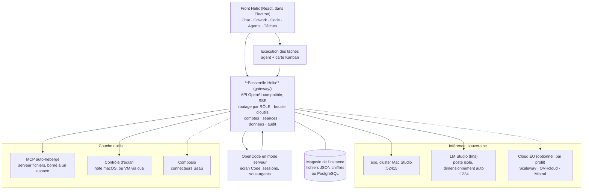

# Architecture Helix — plateforme d'agents IA souveraine

> Document de cadrage technique : les décisions prises, et où en est leur mise en œuvre.
> Les écrans sont inventoriés dans [`SCREENS.md`](./SCREENS.md), l'usage et l'exploitation
> dans [`docs/GUIDE.md`](./docs/GUIDE.md), la sécurité dans [`SECURITE.md`](./SECURITE.md).
> Statut : les grands choix sont arrêtés ; les points encore ouverts portent la marque ⚠.
> Chaque ADR indique ce qui est **implémenté** et ce qui reste une intention.
> Dernière mise à jour : 21/09/2026 (0.25.0).

---

## 1. Objectif

Transformer la coquille front en plateforme fonctionnelle multi-usage, livrée en marque
blanche à des PME :

| Surface | Ce qu'elle doit faire |
|---|---|
| **Chat** | Chatbot type ChatGPT, modèle **local** ou **cloud européen**, au choix de l'utilisateur |
| **Cowork** | Assistant qui **agit sur l'ordinateur** : fichiers, applications, outils métier, **avec et sans MCP**, jusqu'au contrôle d'écran |
| **Code** | Agent de développement type Claude Code, avec sous-agents |
| **Agents** | Agents personnalisés, créés par l'entreprise, connectables à des outils externes |
| **Tâches** | Déléguer une tâche à un agent : il l'exécute et fait avancer la carte (à faire → en cours → terminée) |

**Contrainte cardinale (décidée) : strict EU / local.** Aucune dépendance à un fournisseur
de modèles américain. Inférence sur infrastructure cliente ou cloud européen uniquement.

---

## 2. Principes directeurs

1. **Deux briques partagées, pas six produits.** Une *passerelle modèles* et un *runtime
   d'agent* uniques. Chat, Cowork, Code et Tâches sont **la même machine** avec des jeux
   d'outils et des surfaces différentes.
2. **On intègre, on ne réécrit pas.** OpenCode, UI-TARS, exo, LM Studio sont matures :
   on les embarque. On écrit la colle, l'UI et la logique métier.
3. **Le modèle est un détail d'implémentation.** L'UI parle de *rôles* (chat, code,
   vision, contrôle d'écran), la passerelle choisit le backend.
4. **Zéro configuration visible.** Si l'utilisateur choisit « local », tout s'installe et se
   dimensionne tout seul.
5. **Licences compatibles white-label commercial.** MIT / Apache-2.0 uniquement pour le cœur.

---

## 3. Vue d'ensemble

Trait plein : implémenté. Trait pointillé : décidé, pas encore écrit.

---

## 4. Décisions d'architecture (ADR)

### ADR-001 — Passerelle modèles unique, routage par rôle ✅ implémenté

**Contexte.** L'utilisateur choisit un modèle dans l'UI, mais les besoins diffèrent :
un modèle de chat n'est pas un modèle de *grounding* GUI ni un modèle vision.

**Décision.** Un service **Helix Model Gateway**, API OpenAI-compatible, seul point de
sortie vers un LLM. Il expose des **rôles** :

| Rôle | Usage | Modèle type |
|---|---|---|
| `chat` | Chat, résumés, rédaction | Kimi K2 Thinking, Qwen3 |
| `code` | Code, sous-agents | Kimi K2, Qwen3-Coder |
| `vision` | Documents, images | Kimi-VL, Qwen3-VL |
| `gui` | Contrôle d'écran (grounding) | UI-TARS 7B / 72B |
| `embed` | Recherche, mémoire | modèle d'embeddings local |

Le sélecteur de l'UI pilote `chat`/`code`. Les rôles `gui`/`vision`/`embed` sont choisis
**automatiquement** selon l'action, sans intervention utilisateur.

**État réel.** Le classement par rôle est **heuristique**, fondé sur l'identifiant du
modèle : la plupart des serveurs OpenAI-compatibles n'exposent aucune métadonnée de
capacité. Le profil de déploiement (`models`) permet d'imposer un modèle par rôle, et
prime alors sur toute détection. À rôle égal, la passerelle préfère un modèle déjà chargé
en mémoire, puis le backend le plus prioritaire.

**Conséquences.** Un seul endroit gère la découverte des modèles, leur chargement et leur
déchargement, le routage par rôle et le relais du canal de raisonnement. Changer
d'infrastructure revient à changer une configuration : **le front n'est jamais modifié
quand l'infra change.**

⚠ **Pas encore là, malgré ce que laisse croire l'écran « Mon usage »** : la passerelle ne
compte ni les jetons, ni les requêtes, ni les coûts, et n'applique aucun quota. Un appel
qui échoue est réessayé une fois sur le même backend, mais il n'y a **pas de bascule
automatique vers un autre backend**. Ces trois points restent à écrire.

**Alternatives rejetées.** Appels directs depuis chaque surface (duplication, impossible à
gouverner) ; LiteLLM seul (utile mais ne couvre ni le cycle de vie local ni le routage par rôle —
peut être utilisé *à l'intérieur* de la passerelle).

---

### ADR-002 — Backends d'inférence : exo (cluster) + LM Studio (poste), zéro fournisseur US

**Contexte.** Deux profils de déploiement très différents : cluster Mac Studio chez le
client, ou poste isolé « comme LM Studio / Ollama ».

**Décision.**

- **Cluster on-prem (cible principale).** [`exo`](https://github.com/exo-explore/exo)
  agrège plusieurs Mac Studio (MLX + **RDMA sur Thunderbolt 5**, macOS 26.2) et sert des
  modèles jusqu'à ~1 T de paramètres. Repère public : **Kimi K2 Thinking ~1 T à ~25 tok/s
  sur 4 × M3 Ultra**, API OpenAI-compatible sur `:52415`.
- **Poste isolé.** **LM Studio headless** (`lms` / daemon `llmster`), API OpenAI-compatible
  sur `:1234`, entièrement scriptable (download, load, unload, serve).
- **Cloud EU** (Scaleway, OVHcloud, Mistral, Nebius) : **branchable mais désactivé par
  défaut** en mode strict. Tous sont OpenAI-compatibles → simple changement de `base_url`.

**État réel.** Les deux backends de base sont câblés dans la passerelle et interrogés à
chaque découverte : `exo` sur `:52415` et `lmstudio` sur `:1234`, l'un et l'autre
redirigeables par `HELIX_EXO_URL` et `HELIX_LMSTUDIO_URL`. Le cluster est prioritaire sur
le poste. Un cloud européen s'ajoute par `backends` dans `helix.config.json` : c'est du
code générique « OpenAI-compatible », il n'y a **pas d'intégration spécifique** à
Scaleway, OVHcloud ou Mistral.

Le cycle de vie des modèles n'est automatisé **que pour LM Studio** : démarrage du
serveur local, `lms ls`, `lms ps`, `lms get`, `lms load`, `lms unload`, arrêt à la
fermeture. Côté exo, la passerelle se contente de lire `/v1/models` et d'y router des
requêtes ; elle ne sait ni y télécharger ni y charger un modèle.

**Conséquences.** ⚠ Le cluster exo est **bleeding-edge** : il exige macOS 26.2, du
Thunderbolt 5 et RDMA pour tenir les ~25 tok/s (sinon ~5 tok/s), coûte ~40 k€ pour
4 × M3 Ultra 512 Go et demande de l'exploitation. Ce n'est pas « plug and play ».
⚠ La mémoire du cluster est un budget partagé : Kimi K2 **+** UI-TARS-72B **+** un VL
simultanément peut ne pas tenir → prévoir du **model-swapping** piloté par la passerelle,
ou UI-TARS-7B (grounding déjà bon, bien plus léger).

---

### ADR-003 — Runtime d'agent unique, fondé sur OpenCode

**Contexte.** Code, Cowork et Tâches ont besoin de la même chose : une boucle
d'outils fiable, des sessions, des sous-agents, du streaming.

**Décision.** **[OpenCode](https://opencode.ai) (MIT)** comme moteur, exécuté en **mode
serveur** et piloté par le front Helix. Il apporte déjà : provider-agnostic (tout endpoint
OpenAI-compatible), boucle d'outils, sous-agents, diagnostics LSP, gestion de sessions.

- **Code** = OpenCode + outils dépôt/LSP.
- **Cowork** = OpenCode + outils fichiers/MCP/computer-use.
- **Chat** = le runtime sans outils lourds (ou une voie directe vers la passerelle).
- **Tâches** = un run du runtime, rattaché à une carte.

Précédent : [`openwork`](https://github.com/different-ai/openwork) est déjà une alternative
à Cowork **construite sur OpenCode** — l'approche est validée par un tiers.

**État réel.** La décision n'a été appliquée **qu'à l'écran Code**. Chat, Cowork et Tâches
n'utilisent pas OpenCode : ils passent par la boucle d'outils écrite dans la passerelle
(`gateway/src/chat.ts`), qui exécute elle-même les outils MCP et les actions d'écran, avec
un découpage en étapes adapté à la taille du modèle. C'est le même moteur pour ces trois
surfaces, mais ce n'est pas OpenCode.

Pour l'écran Code, la passerelle localise le binaire `opencode`, écrit un
`opencode.json` dans le dossier de projet avec un fournisseur unique (elle-même,
authentifiée par le jeton d'instance), lance `opencode serve` sur la boucle locale et
relaie sessions, prompts, interruptions et flux d'évènements.

⚠ **OpenCode n'est pas empaqueté dans l'installeur.** Il doit être présent sur la machine
(`~/.opencode/bin/opencode` ou dans le `PATH`) ; sinon l'écran Code annonce que le moteur
est absent. Dire « OpenCode embarqué » serait inexact.

**Conséquences.** Un moteur de plus à maîtriser, à sécuriser et à mettre à jour, pour une
seule surface. La dépendance à son API serveur n'est **pas encore** isolée derrière une
interface Helix : il n'existe pas d'abstraction `AgentRuntime` dans le code, les appels
passent directement par `gateway/src/opencode.ts`. À faire si l'on veut pouvoir en
changer sans douleur.

**Alternatives rejetées.**
- **Claude Agent SDK / [open-claude-cowork](https://github.com/composio-community/open-claude-cowork)** : lie le cœur du produit à Anthropic → **incompatible avec la contrainte strict EU/local**.
- **[Eigent](https://github.com/eigent-ai/eigent)** (Apache-2.0, workforce multi-agents CAMEL, 200+ outils) : excellent, mais opiniâtre et lourd ; **réévaluer plus tard** si le besoin de workforce parallèle se confirme.
- **[AionUi](https://github.com/iOfficeAI/AionUi)** : on a déjà notre GUI. On en **reprend le patron** (gestionnaire MCP unifié, backends d'agents pluggables), pas l'application.

---

### ADR-004 — Couche outils : MCP partout ⚠ révisé le 05/09/2026

> **Cette décision a été révisée.** Composio n'est plus la voie des connecteurs
> SaaS. Règle actuelle : ne jamais introduire un tiers que le client n'a pas déjà
> choisi. Voir ADR-014 et `PROJET.md` § 3.5. Le texte d'origine est conservé
> ci-dessous pour l'historique.

**Contexte.** Les agents doivent atteindre des outils internes (fichiers, bases, logiciels
métier) **et** des SaaS externes (Gmail, Slack, Notion, GitHub…). Écrire et maintenir des
dizaines d'intégrations OAuth est un projet en soi.

**Décision.** **MCP est le protocole unique** côté agent. Deux fournisseurs derrière :

1. **MCP auto-hébergé** pour tout ce qui est **interne ou sensible** : serveurs officiels
   [`modelcontextprotocol/servers`](https://github.com/modelcontextprotocol/servers)
   (filesystem, Postgres, GitHub/GitLab…) lancés en local via `npx`/`uvx`, plus les
   serveurs métier spécifiques au client. Les serveurs tournent sur la machine et
   dialoguent en JSON-RPC sur l'entrée et la sortie standard : **aucune donnée de
   l'entreprise ne quitte le poste**. Le code du serveur, lui, est récupéré une première
   fois sur le registre npm par `npx` (voir docs/GUIDE.md, « Ce qui sort de la machine »).
2. **[Composio](https://composio.dev)** pour les **connecteurs SaaS externes** (500+ apps).
   Rationnel retenu : *un connecteur Gmail ou Slack envoie de toute façon les données vers
   un service américain* — la perte marginale de souveraineté est faible, et le gain de
   temps est considérable.

⚠ **Nuance à assumer (importante).** Le SDK et le serveur MCP Composio sont MIT et
auto-hébergeables, **mais le backend qui stocke les credentials et exécute les tool calls
est closed-source** (images sous licence entreprise) : en offre standard, **Composio détient
les jetons OAuth des comptes de vos clients** et les appels transitent par son
infrastructure. Ce n'est plus seulement une question de résidence des données, mais de
**garde des secrets**. Trois parades, à trancher :

- **(a)** N'activer Composio **que** pour les SaaS déjà externes, et l'annoncer clairement
  au client (recommandé par défaut).
- **(b)** Utiliser « bring your own OAuth » (le Tool Router accepte vos propres
  identifiants OAuth) pour garder la main sur les applications.
- **(c)** Offre **Enterprise VPC / on-premise** de Composio pour les clients qui exigent
  la souveraineté totale.

⚠ **Coût.** Composio se facture au volume d'appels d'outils (paliers publics : 20 k
appels/mois offerts, ~29 $/200 k, ~229 $/2 M, Enterprise pour VPC/on-prem). En marque
blanche **multi-clients**, cela devient une **ligne de coût par instance** à modéliser.

⚠ **Cohérence marketing.** Le site Helix affirme « *Vos données ne sortent jamais.
Souveraineté totale.* ». Router des tool calls via Composio contredit cette promesse **au
pied de la lettre**. Ce n'est pas un blocage technique — c'est une **formulation à ajuster**
(ex. « vos modèles et vos données métier ne sortent jamais ; les connecteurs vers vos SaaS
existants transitent par un routeur d'intégration ») ou un **réglage par client**
(auto-hébergé seul = promesse tenue à 100 %).

**Décision retenue :** architecture **à deux fournisseurs MCP interchangeables** derrière
une interface unique `ToolProvider`. Composio est un **module activable**, jamais un
prérequis. Une instance strictement souveraine fonctionne sans lui.

**État réel : seule la moitié auto-hébergée existe.**

| Élément | État |
|---|---|
| Gestionnaire de serveurs MCP, démarrage, arrêt, inventaire des outils | ✅ `gateway/src/mcp.ts` |
| Serveur **fichiers**, borné à un espace de travail explicite, changeable depuis l'interface | ✅ seul serveur livré par défaut |
| Boucle d'appels d'outils vers le modèle, avec trace dans la conversation | ✅ `gateway/src/chat.ts` |
| Ajout d'un serveur MCP par l'intégrateur depuis l'interface | ❌ la liste des serveurs est figée dans le code |
| Interface `ToolProvider` | ❌ n'existe pas |
| **Composio** | ❌ aucune ligne de code. La promesse commerciale des « connecteurs SaaS » n'est pas tenue à ce jour |

Autrement dit : **la promesse de souveraineté de cet ADR est aujourd'hui tenue à 100 %,
parce que le seul fournisseur qui la mettrait en cause n'est pas branché.** Les
avertissements ci-dessus deviendront pertinents le jour où Composio sera intégré ; ils
sont conservés pour que la décision soit prise en connaissance de cause.

---

### ADR-005 — Computer-use : OpenCUA pour le modèle, cua pour l'environnement

> Le titre d'origine disait « UI-TARS auto-hébergé ». UI-TARS a été **écarté** le
> 25/07/2026 : son modèle 72B plafonne à 38,1 sur ScreenSpot-Pro, battu par un
> Qwen3-VL de 8 milliards de paramètres à 52,7.

**Contexte.** Cowork doit agir sur les logiciels du client, **avec ou sans MCP** — donc
y compris sur des applications qui n'exposent aucune API.

**Décision (révisée le 25/07/2026).** Deux briques distinctes, à ne pas confondre :

| Rôle | Choix | Pourquoi |
|---|---|---|
| **Modèle** (perception + grounding GUI) | **[OpenCUA](https://opencua.xlang.ai/)** (7B / 32B / 72B, auto-hébergeable) | État de l'art open source : **45,0 % OSWorld-Verified**, **60,8 ScreenSpot-Pro**. Bâti sur Qwen2.5-VL et Kimi-VL, donc cohérent avec un cluster orienté Kimi |
| **Environnement d'exécution** | **[trycua/cua](https://github.com/trycua/cua)** (drivers computer-use open source, VM sandbox, flottes multi-OS) | De l'**infrastructure**, pas une application concurrente : s'embarque sans imposer son interface. Donne à l'agent **son propre ordinateur** plutôt que de détourner l'écran de l'utilisateur. Bytebot fait la même chose, en moins mature |

**Comparatif des « cowork » open source (vérifié le 25/07/2026).** Le contrôle d'écran est
plus rare qu'il n'y paraît :

| Projet | Modèles | Contrôle d'écran réel | ★ |
|---|---|---|---|
| **trycua/cua** | agnostique | ✅ dédié | 20,5k |
| **OpenCoworkAI/open-cowork** | Claude, OpenAI-compat, GLM, Kimi | ✅ « GUI Operation » | 1,9k |
| accomplish-ai/coworker | multi + Ollama/LM Studio | ❌ navigateur seul | 10,9k |
| different-ai/openwork | multi, *powered by opencode* | ❌ | 17,2k |
| composio-community/open-claude-cowork | Claude SDK (+OpenCode) | ❌ navigateur via Composio | 4,3k |

**Référence d'implémentation : `open-cowork`** — même pile que Helix (Electron, React,
Tailwind, Node, SQLite, TypeScript) et compatible OpenAI, donc exploitable avec LM Studio.
On s'inspire de ses schémas d'interface GUI ; on ne l'adopte pas.

**Note sur le Claude Agent SDK.** Vérifié sur machine : **LM Studio expose un endpoint
`/v1/messages` compatible Anthropic, outils inclus** (`type: tool_use`,
`stop_reason: tool_use`). Un SDK Anthropic pointé sur `localhost` ne fait donc sortir
aucune donnée : ce n'est pas disqualifié par la souveraineté. Il reste écarté comme moteur
principal pour ne pas dépendre d'une bibliothèque tierce là où OpenCode est déjà agnostique.

**Pourquoi un bureau dédié plutôt que l'écran de l'utilisateur.** Le collaborateur continue
de travailler pendant que l'agent agit ; une erreur reste confinée ; et les logiciels métier
du client s'installent dans un environnement maîtrisé et reproductible. Le contrôle de
l'écran réel reste possible, mais devient un mode explicite et non le mode par défaut.

**Paliers de modèle GUI** (ScreenSpot-Pro entre parenthèses) :

| Machine | Modèle |
|---|---|
| Cluster Mac Studio | **OpenCUA-72B** (60,8) |
| Workstation | **OpenCUA-32B** |
| Portable PME | **Qwen3-VL-8B** (52,7) ou OpenCUA-7B |

**Modèles écartés.** **UI-TARS** (2025) est désormais dépassé : UI-TARS-72B ne fait que
**38,1** sur ScreenSpot-Pro, soit moins qu'un **Qwen3-VL-8B (52,7)**. La génération 2026
(OpenCUA, UI-Venus-1.5, EvoCUA, GUI-Owl-1.5) est bâtie sur Qwen3-VL. À surveiller :
**EvoCUA**, premier des agents open source sur OSWorld pour les tâches longues.

⚠ **Niveau de fiabilité réel, à ne pas masquer.** Le meilleur modèle auto-hébergeable
réussit **45 % des tâches OSWorld-Verified** — moins d'une sur deux. Les meilleurs modèles
propriétaires montent plus haut mais sont fermés et américains, donc exclus par la
contrainte de souveraineté. **Conséquence commerciale : le contrôle d'écran ne doit pas
être vendu comme une fonction fiable**, mais comme une capacité assistée, sous approbation.

**Licence vérifiée le 13/09/2026** : OpenCUA 7B et 32B sous MIT ; 72B sous MIT mais bâti
sur Qwen2.5-VL 72B, donc soumis à la licence Qwen (commercial sous 100 M d'utilisateurs
par mois, attribution, droit chinois). Voir PROJET.md § 3.9.

**Le vrai garde-fou architectural** : ce domaine bouge vite (UI-TARS est devenu obsolète en
un an). Aucun modèle n'est câblé en dur — la passerelle expose un **rôle `gui`**, et changer
de modèle est une ligne de configuration. C'est l'abstraction qu'on épouse, pas le modèle.

Cowork expose donc **deux voies d'action** dans le même agent :

| Voie | Quand | Fiabilité |
|---|---|---|
| **Structurée** : fichiers, shell, MCP | L'outil a une API ou un serveur MCP | Élevée |
| **Visuelle** : capture, puis clic ou frappe, guidés par un modèle de rôle `gui`/`vision` | Logiciel fermé, sans API | Moyenne, s'améliore |

Les deux jeux d'outils sont proposés **dans la même liste** au modèle, qui enchaîne
fichiers et écran dans une seule demande. Les outils `ecran__…` ne sont offerts qu'à un
modèle qui sait lire une image : c'est le seul garde-fou automatique. La préférence
pour la voie structurée relève aujourd'hui du jugement du modèle et de la description
des outils, elle n'est pas imposée par le code.

**Conséquences.** ⚠ Le contrôle d'écran reste la capacité **la moins fiable de tout le
système**, quel que soit le fournisseur. Conséquences produit obligatoires :
- **Approbations** : l'UI Cowork a déjà les trois niveaux (*Demander une approbation /
  Approuver pour moi / Accès complet*) — ils doivent être **réellement appliqués**.
- **Sandbox** et périmètre de fichiers explicite (l'UI a déjà *Tous mes fichiers / Choisir
  un dossier*).
- **Journal d'actions rejouable** (ce que l'agent a vu, cliqué, écrit).

---

### ADR-006 — Agents et Tâches : configurations + runs, pas un second framework

**Contexte.** Tentation d'ajouter [OpenClaw](https://github.com/openclaw/openclaw)
(agents managés, délégation de sous-agents, allowlists, tokens HMAC) ou
[Hermes Agent](https://github.com/NousResearch/hermes-agent) (MIT, mémoire persistante,
skills auto-apprises, cron).

**Décision v1 : ni l'un ni l'autre.**
- Un **Agent** = une configuration persistée (prompt système, outils autorisés, modèle,
  visibilité personnel/organisation) exécutée par le runtime de l'ADR-003. C'est exactement
  ce que la modale « Créer un agent » du front collecte déjà.
- Une **Tâche déléguée** = un **run** de cette configuration, rattaché à une carte, qui
  écrit son avancement dans le Kanban (`à faire → en cours → terminée / annulée`).
  Depuis la 0.19.0, une tâche peut en attendre d'autres (`dependsOn`) et partir
  d'elle-même après elles (`autoStart`), avec leurs comptes rendus dans sa consigne ;
  les runs sont tenus par `src/lib/executions.ts`, pour toute l'application.

**Conséquences.** Un seul modèle mental, une seule dette. **Réévaluation prévue** dès que
l'un de ces besoins apparaît : agents *always-on* multi-utilisateurs, isolation stricte
par agent, délégation profonde entre agents → **OpenClaw** devient pertinent.
Mémoire longue qui s'améliore toute seule → **Hermes**. Introduire les deux aujourd'hui
serait payer deux frameworks pour des besoins non prouvés.

---

### ADR-010 — Identité, profils privés et sessions partageables ✅ implémenté

**Contexte.** L'application est installée sur un poste, mais plusieurs personnes d'une
même entreprise l'utilisent. Chacune doit avoir **sa** personnalité d'agent, **son**
contexte et **sa** mémoire — tout en pouvant partager des conversations avec l'équipe.

**Décision.** Séparation nette entre ce qui est **privé** et ce qui est **partageable** :

| Donnée | Portée | Partage |
|---|---|---|
| Instructions personnalisées (personnalité) | Utilisateur | **Jamais** |
| Contexte personnel | Utilisateur | **Jamais** |
| Mémoire de l'IA | Utilisateur | **Jamais** |
| Préférences (modèle, effort) | Utilisateur | Jamais |
| Identifiants cloud | Utilisateur | Jamais, et **hors du contexte LLM** |
| **Sessions de conversation** | Utilisateur (propriétaire) | **Privé / Groupes / Organisation** |

Tout objet partageable porte `ownerId`, `visibility` et `sharedGroupIds` — exactement le
modèle que l'interface collecte déjà (Bibliothèque, Agents).

**Local ou cloud : une session n'est pas toujours partageable.** Une conversation menée
sur un **modèle local** dépend d'une machine précise : elle reste sur ce poste et le
partage est refusé avec un message explicite. Une session **cloud** est reprenable depuis
un autre poste, donc partageable. Le champ `origin` porte cette distinction.

Le message système envoyé au modèle est **reconstruit à chaque conversation** depuis le
profil privé de l'utilisateur connecté (personnalité + contexte + mémoire).

**État réel.** L'authentification existe et fonctionne :

- écran de rattachement du poste (machine seule, ou adresse et jeton d'une instance
  d'entreprise), puis écran de connexion ;
- comptes stockés dans l'instance, mot de passe dérivé par PBKDF2-SHA256 et vérifié côté
  serveur, tentatives limitées ;
- **séances** par personne et par poste, expiration glissante, révocables une par une
  depuis les réglages ;
- cloisonnement appliqué **par l'instance** et non par l'interface : le profil, qui porte
  personnalité, contexte et mémoire, n'est jamais renvoyé à un autre compte, et une
  écriture ne retient que les enregistrements que le poste a le droit de toucher.

Le message système envoyé au modèle est bien reconstruit à chaque conversation depuis le
profil privé de l'utilisateur connecté.

**Persistance.** Le magasin de référence est celui de l'instance (fichiers JSON chiffrés
ou PostgreSQL, cf. ADR-007). Chaque poste en garde une copie dans le stockage local de
son navigateur, ce qui laisse toutes les lectures de l'interface synchrones et permet de
travailler quand l'instance est injoignable. SQLite n'est pas utilisé.

**Le partage entre postes fonctionne** dès lors qu'une machine héberge l'instance
(`share: true`) : elle écoute alors sur le réseau, sert en TLS, et les autres postes la
visent par son adresse et son jeton. Sur une installation isolée, « partagé » signifie
« partagé entre les comptes de cette machine ».

Le champ `origin` reste enregistré, mais ne limite plus le partage : les conversations
vivent dans l'instance, qui les sert à tous ses postes quel que soit le modèle. Le
partage se fait par adresse, ou à un groupe (0.16.0, ADR-027) ; l'instance fait
respecter les trois, et retire l'accès à qui sort d'un groupe.

---

### ADR-011 — Contrôle de l'écran : ce qui est livré ✅ implémenté

**Contexte.** ADR-005 fixe la stratégie ; celui-ci décrit l'implémentation réelle, pour que
personne ne promette au client ce qui n'existe pas.

**Trois modes**, choisis dans `helix.config.json` (`computerUse.mode`), ou `hote`
activé depuis l'interface sur un poste autonome depuis 0.10.0 (`gateway/src/reglagesEcran.ts` :
le profil prime, instance partagée exclue, mot de passe redemandé) :

| Mode | Ce que l'agent pilote | État |
|---|---|---|
| `desactive` | rien | **par défaut** |
| `hote` | la machine de l'utilisateur | livré et vérifié sur macOS |
| `sandbox` | une VM dédiée, via cua/Lume | livré côté passerelle, **non vérifié faute de VM sur la machine de développement** |

**Pilote hôte : zéro dépendance à installer.** Tout vient de macOS.

| Besoin | Moyen | Autorisation macOS |
|---|---|---|
| Voir l'écran | `screencapture` + `sips` pour réduire à **1024 px** de large (`HELIX_CAPTURE_LARGEUR`) | Enregistrement de l'écran |
| Souris (déplacer, cliquer, double-cliquer, clic droit, glisser, molette) | évènements CoreGraphics, via le pont ObjC de JavaScript for Automation | Accessibilité |
| Clavier (texte et raccourcis) | `System Events` | Accessibilité |
| Ouvrir une application | `open -a` | aucune |

Un binaire tiers (`cliclick`) aurait ajouté une dépendance à empaqueter, signer et
maintenir, pour des primitives que le système fournit déjà.

1024 px et non 1280 : chaque pixel coûte de la mémoire et du temps au modèle. Sur un Mac
de 16 Go, une capture de 1280 px fait basculer la machine en mémoire virtuelle et la
lecture prend plusieurs minutes, contre une vingtaine de secondes à 1024 px. Le réglage
s'ajuste pour une machine plus généreuse.

Actions disponibles : `capture`, `deplacer`, `cliquer`, `double_cliquer`, `clic_droit`,
`glisser`, `defiler`, `saisir`, `touche`, `ouvrir_app`, `attendre`.

**Conversion des coordonnées.** Le modèle raisonne sur l'image réduite, la souris travaille
en points écran. La passerelle convertit à chaque action à partir de la dernière capture.
Sans cela, **tous les clics tombent à côté sur un écran Retina**.

**Approbation.** Toute action modifiante est mise en attente côté passerelle et poussée à
l'interface par SSE. Elle ne part qu'après un accord explicite, et expire au bout de deux
minutes. Capture, déplacement du curseur et attente ne modifient rien : ils passent
directement. `computerUse.requireApproval: false` lève l'exigence, à réserver aux postes de
démonstration.

**Garde-fou de modèle.** Les outils `ecran__…` ne sont proposés qu'à un modèle qui sait lire
une image (rôle `gui` ou `vision`). Un modèle de conversation à qui on les offrirait
prendrait des captures qu'il ne peut pas voir, puis cliquerait au hasard. Le catalogue de
provisionnement a donc une entrée distincte pour ce rôle (Qwen3-VL 8B / 4B, Qwen3-VL 2B en
dernier recours), et l'interface propose l'installation quand il manque.

**Ce qui est tracé.** Chaque action modifiante laisse quatre traces possibles dans le
journal d'audit sur disque : `ecran.demande`, `ecran.approuve`, `ecran.refuse`,
`ecran.execute`, avec le type d'action, le mode et le résultat. Ni les coordonnées ni le
texte saisi n'y figurent : le journal dit ce qui a été fait, il n'enregistre pas ce que
l'utilisateur a tapé. Les actions qui ne modifient rien (capture, déplacement, attente)
ne sont pas journalisées, pour ne pas noyer ce qui compte.

**Ce qui n'est pas fait.** Pas de **journal rejouable** : la trace d'audit permet de dire
qui a approuvé quoi et quand, pas de rejouer la séquence ni de revoir ce que l'agent
voyait. L'historique détaillé, avec coordonnées et captures, vit en mémoire et disparaît
au redémarrage. Pas de restriction par application : en mode hôte, une action approuvée
s'applique n'importe où sur l'écran. Windows et Linux ne sont pas couverts par le pilote
hôte ; sur ces systèmes, seul le mode sandbox s'applique.

**Sur l'état du mode sandbox (mis à jour le 24/09/2026).** Livré et vérifié : Helix
prépare lui-même la machine (`gateway/src/machine.ts`) : un bureau Linux isolé dans un
conteneur Docker (image cua épinglée + LibreOffice), sur 127.0.0.1:18910, 3 Go au plus,
un dossier d'échange `~/Helix/Machine`. Essais réels Writer, Calc et refus avec
qwen3-vl-4b : voir PROJET.md § 3.2. La machine macOS (Lume) reste à faire ; Windows et
Linux hôtes n'ont pas été essayés (le code ne dépend que de Docker).

**Corrections du 23/09/2026** (tournée de tests, VM simulée qui note chaque commande
sans rien exécuter) : les événements de début et de fin d'action portent le compte de
la personne (le texte tapé par l'agent, un mot de passe par exemple, partait chez tous
les collègues connectés) ; « Arrêter » refuse ce qui attend un accord (un « Autoriser »
cliqué après l'arrêt exécutait encore le clic) ; mode désactivé vérifié **avant** toute
demande d'accord (une carte s'affichait, et l'appel restait bloqué deux minutes) ; un
outil d'écran que le modèle invente sans qu'on le lui ait proposé est refusé ; messages
distincts pour le refus et l'expiration ; cartes et libellés traduits. Reste : la taille
de la dernière capture (`lastImage`) est commune à toute l'instance, pas à chaque
conversation.

---

### ADR-007 — Persistance de l'instance ✅ implémenté

**Décision initiale.** SQLite dans le répertoire de données de l'application.

**Décision retenue, et ce qui est écrit.** SQLite n'a **pas** été utilisé : il aurait
imposé une dépendance native à empaqueter et à signer pour chaque plateforme, alors que
le volume de données d'une PME tient dans quelques fichiers. Le magasin de l'instance
(`gateway/src/db.ts`) expose une interface unique `Store` et deux implémentations :

| Implémentation | Quand | Où |
|---|---|---|
| **Fichiers JSON** (défaut) | poste isolé, petite équipe | un fichier par collection dans `~/.helix/data`, ou `HELIX_DATA_DIR`. Dossier en `700`, fichiers en `600`, écriture atomique par renommage, chiffrés au repos |
| **PostgreSQL** | usage concurrent réel | une table `helix_state`, activée par `database` dans le profil. Le pilote `pg` n'est chargé que si la configuration l'exige |

Collections partagées entre postes : `accounts`, `projects`, `sessions`, `tasks`,
`agents`, `profiles`. Une collection interne, `authSessions`, vit dans le même magasin
mais n'est jamais exposée par les routes de synchronisation.

Chaque poste garde une **copie locale** dans le stockage de son navigateur : les lectures
de l'interface restent synchrones et l'application survit à une instance injoignable. La
synchronisation compare les révisions toutes les quatre secondes et ne repousse que ce
que le poste a le droit de toucher.

Le chiffrement au repos couvre **les deux implémentations** depuis 0.9.0 : même clé,
même enveloppe AES-256-GCM, liée au nom de la collection (voir ADR-021). Le pilote
`pg` n'est pas embarqué dans l'application : une instance PostgreSQL tourne depuis
les sources, avec `npm i pg`.

⚠ Pas d'index de recherche, pas d'historique de runs distinct des tâches, pas de journal
d'outils persisté : ce que l'ADR annonçait sur ces trois points reste à faire.

---

### ADR-008 — Sécurité et garde-fous

**Décision.** Non négociables dès la première version qui touche au système. L'état de
chacun est détaillé dans [`SECURITE.md`](./SECURITE.md) ; en résumé :

| Garde-fou | État |
|---|---|
| **Approbation explicite** avant toute action d'écran modifiante | ✅ mise en attente côté passerelle, poussée à l'interface par SSE, expiration à deux minutes |
| **Périmètre de fichiers déclaré** | ✅ le serveur MCP fichiers ne reçoit qu'un dossier, validé côté instance : tout dossier sauf les emplacements du système et la racine, comparaison insensible à la casse |
| **Sandbox d'exécution** | ⚠ existe pour l'écran (mode `sandbox`, VM cua), pas pour les outils fichiers, qui s'exécutent sur le poste |
| **Secrets hors du contexte LLM**, chiffrés au repos | ✅ aucun jeton n'entre dans un prompt ; les données de l'instance sont chiffrées en AES-256-GCM dans le magasin fichiers |
| **Traçabilité** | ✅ le journal d'audit scelle connexions, séances, création de compte, écritures de données, actions d'écran **et tout appel d'outil MCP, lectures comprises** (`outil.appele` dans `gateway/src/chat.ts` : compte, nom de l'outil, chemin visé, succès). ⚠ Une réserve : les lignes d'actions d'écran portent les libellés fixes `agent` et `utilisateur`, sans identifiant de compte |
| **Injection de prompt** : le contenu lu reste une donnée | ⚠ aucune barrière technique. Les deux protections réelles sont le périmètre de fichiers et l'approbation humaine des actions d'écran |

L'approbation ne couvre aujourd'hui que les actions d'écran. Une écriture ou une
suppression de fichier par le serveur MCP part **sans demander d'accord** : les niveaux
« Demander une approbation / Approuver pour moi / Accès complet » de l'interface Cowork
ne sont pas encore appliqués aux outils fichiers.

---

### ADR-009 — Provisionnement automatique du modèle local ✅ implémenté

**Contexte.** Exigence produit : « si l'utilisateur choisit un modèle local, tout doit
s'installer sans qu'il s'en rende compte ».

**Décision.** Au premier lancement en mode local, la passerelle :
1. **Profile la machine** (RAM unifiée, GPU/Apple Silicon, disque libre) ;
2. **Choisit un modèle par palier** dans un catalogue Helix versionné ;
3. **Installe et charge** via `lms` (téléchargement + `lms load`), en tâche de fond, avec
   progression dans l'UI ;
4. **Vérifie** par un appel de santé, puis marque le rôle `chat` comme prêt.

**Catalogue réellement embarqué** (`gateway/src/provision.ts`). La passerelle retient la
première entrée dont la machine satisfait le seuil mémoire. Sur Apple Silicon la mémoire
est unifiée, donc comptée en entier ; ailleurs, 70 % seulement.

| Rôle `chat` / `code` | Mémoire minimale | Téléchargement |
|---|---|---|
| Qwen3 8B (recommandé) | 16 Go | ~5 Go |
| Qwen3 4B | 8 Go | ~2,5 Go |
| Qwen3 1.7B (dernier recours) | aucune | ~1,2 Go |

| Rôle `gui` (lecture d'écran) | Mémoire minimale | Téléchargement |
|---|---|---|
| Qwen3-VL 8B (recommandé) | 24 Go | ~6 Go |
| Qwen3-VL 4B | 12 Go | ~3,5 Go |
| Qwen3-VL 2B (dernier recours, pointage moins précis) | aucune | ~2 Go |

Le catalogue `gui` est **distinct** : un modèle de conversation ne voit pas les images et
ne peut donc pas remplacer un modèle de vision. Les seuils du rôle `gui` s'ajoutent à
ceux du modèle de conversation, puisque les deux tournent en même temps quand Cowork
pilote l'écran.

Un modèle inutilisé pendant vingt minutes se décharge tout seul (`--ttl`). Sans cela les
modèles s'empilent et une machine de 16 Go bascule en mémoire virtuelle.

⚠ **À dire honnêtement au client** : un portable de PME fait tourner un modèle de 4 à 8
milliards de paramètres, **pas** le « 397 B » affiché dans la maquette. Sur un cluster
exo ou un cloud européen, les modèles ne sont pas provisionnés par Helix : c'est
l'intégrateur qui les met en place, et `autoProvision: false` le dit à l'écran de mise
en route.

**Comportement implémenté.** Au premier lancement sans modèle, l'écran de mise en route
profile la machine (mémoire, cœurs, Apple Silicon), propose l'entrée de catalogue la plus
capable qu'elle supporte, puis télécharge et charge en affichant la progression. Trois
garde-fous appris en test réel :
- un modèle **déjà chargé** est détecté (`lms ps`) : aucun téléchargement ni chargement inutile ;
- un modèle **déjà installé** (`lms ls`) saute le téléchargement ;
- un **refus pour mémoire insuffisante** décharge d'abord les autres modèles résidents,
  puis, si cela ne suffit pas, **replie sur le palier inférieur** au lieu d'un échec sec ;
- un téléchargement laissé en cours par une exécution précédente est détecté et suivi,
  plutôt que relancé en double.

**Installation du moteur, ajoutée depuis.** Helix installe désormais **LM Studio
lui-même**, sur macOS, sans clic ni fenêtre d'installation : il lit l'adresse et
l'empreinte SHA-256 de la version courante dans le catalogue Homebrew
(`formulae.brew.sh`), refuse toute adresse qui ne vienne pas de `installers.lmstudio.ai`,
télécharge le paquet en calculant son empreinte au fil de l'eau, **vérifie cette
empreinte avant d'ouvrir l'image**, copie l'application, puis déclare l'outil en ligne de
commande depuis le paquet. Le tout enchaîne sur le choix et le chargement du modèle : du
point de vue de l'utilisateur, installer Helix est une seule opération.

⚠ **Limites connues** : l'installation automatique du moteur n'existe **que sur macOS**.
Ailleurs, l'écran de mise en route indique que LM Studio est absent et renvoie vers son
installation. Le moteur d'inférence n'est toujours pas empaqueté dans l'installeur Helix,
et le paquet téléchargé reste soumis à la licence de LM Studio.

---

### ADR-012 — Découpage des tâches lourdes, adapté à la taille du modèle ✅ implémenté

**Contexte.** Le modèle par défaut d'un poste de PME est un 8B. Mesuré sur
qwen3-8b avec « range ces quatre factures dans des dossiers par client » : une
fois il s'est arrêté à mi-chemin sans un mot, une fois il a listé le dossier puis
expliqué ce qu'il *faudrait* faire au lieu de le faire. Élargir le budget
d'outils n'y change rien : ce n'est pas la place qui manque, c'est le fil qui se
perd.

**Décision.** La passerelle demande d'abord un **plan**, puis exécute **une étape
à la fois** (`gateway/src/plan.ts`, boucle par étapes dans
`gateway/src/chat.ts`). Chaque étape a sa propre petite boucle d'outils et un
contexte réduit à ce qu'elle exige. **L'avancement est tenu par l'instance, pas
par le modèle** : à chaque étape, celui-ci ne voit qu'un objectif simple et le
résultat des précédentes.

**Découper est un compromis, pas un progrès en soi.** Sur un grand modèle, c'est
du temps perdu et de la qualité en moins : il tient l'ensemble en tête, voit les
raccourcis, et un plan imposé l'empêche de s'adapter à ce qu'il découvre. D'où un
régime choisi d'après la taille annoncée (fonction `strategie`) :

| Taille du modèle | Découpage | Budget par étape | Budget en direct |
|---|---|---|---|
| moins de 14 milliards | jugé par le modèle | 8 | 30 |
| de 14 à 45 milliards | jugé par le modèle, étapes larges | 14 | 40 |
| 45 milliards et plus | jamais | 20 | 50 |
| inconnue, moteur local | jugé par le modèle, par prudence | 8 | 30 |
| inconnue, moteur distant | jamais, supposé capable | 8 | 50 |

Le budget en exécution directe est plafonné par `HELIX_MAX_ETAPES`, **30 par
défaut** : 40 et 50 supposent de relever cette variable. Un premier plan est
limité à 15 étapes. Une demande qui porte une image n'est jamais découpée : les étapes
repartent d'un contexte réduit au texte, l'image serait perdue dès la seconde.

**Depuis la 0.20.0, le modèle juge** s'il faut découper (un appel court, sans
outils ni raisonnement, qui voit aussi la conversation) au lieu d'une liste de
mots ; une étape trop grosse est **redécoupée** (jusqu'à trois niveaux, 60 étapes
par demande) ; une rédaction longue sans outils se fait partie par partie ; les
étapes suivantes reçoivent les **données lues par les outils**, pas seulement le
résumé du modèle ; une étape se juge aux **retours des outils** (des modifications
refusées ne sont jamais « faites ») ; une étape qui modifie est **contrôlée** sur
l'état réel, et le modèle finit ce qui manque. Depuis la 0.21.0, une **revue
finale** relit la demande entière contre le résultat (compléments si besoin), et
un **contrôle automatique du code web** (`controleWeb.ts`, sans dépendance, rien
n'est exécuté : `node:vm` compile sans lancer) vérifie liens, fonctions,
éléments et syntaxe ; ce qu'il voit a le dernier mot sur l'avis du modèle.

**Deux garde-fous appris en essai.** Une étape d'action qui n'a **rien modifié**
est redemandée une fois, plus fermement : un agent qui commente au lieu d'agir
donne l'apparence du travail fait. Une étape ratée **arrête le plan** : observé
tel quel, l'étape « lire le nom du client » ayant échoué, la suivante a créé un
dossier « CLIENT1 » et y a déplacé une vraie facture. Le récapitulatif final dit
alors où le travail s'est arrêté, pourquoi, et ce qui n'a pas été lancé.

**Conséquences.** C'est plus lent qu'un passage unique, et c'est le but : un
travail lourd aboutit sur une machine modeste au lieu d'échouer vite. Le
détail complet est dans [`SCREENS.md`](./SCREENS.md), § 6.

---

### ADR-013 — Atelier bureautique de Cowork : préparation déterministe ✅ implémenté

**Contexte.** Cowork ne dispose que d'outils de système de fichiers. Pour produire
et relire du Word, de l'Excel, du PowerPoint et du PDF, la machine doit porter
les bibliothèques correspondantes.

**Décision, et ce qu'elle écarte.** La tentation serait de demander au modèle de
« préparer la machine » en tapant des commandes. C'est **exclu** : le modèle par
défaut est un 8B local, il improviserait des commandes système sur le poste de
quelqu'un. La préparation est donc **déterministe et exécutée par la passerelle**
(`gateway/src/atelier.ts`) :

- la liste des paquets Python et Node est **figée dans le code** ;
- aucune chaîne n'est construite depuis une entrée utilisateur ;
- tout passe par `execFile` ou `spawn` avec un **tableau d'arguments**, jamais
  par un shell ;
- l'installation se fait dans un environnement **isolé** sous
  `<HELIX_DATA_DIR>/cowork` : un environnement virtuel Python et un préfixe npm.
  Ni les installations globales, ni le `PATH`, ni les projets ne sont touchés ;
- **aucun droit administrateur** n'est demandé ;
- l'interface annonce le nombre de bibliothèques, la place occupée et le dossier
  exact **avant** d'installer, et attend un accord explicite.

Les deux routes qui agissent (`POST /helix/atelier/preparer`,
`/helix/atelier/verifier`) exigent une séance utilisateur ; `GET /helix/atelier`
est un diagnostic en lecture seule.

**Ce qui est volontairement absent du catalogue** : matplotlib et sharp (lourds,
et sharp compile du natif à l'installation, échec assuré sur un poste sans chaîne
de compilation), `@napi-rs/canvas` et tesseract.js (graphisme et reconnaissance
de caractères, hors du besoin de base). LibreOffice et Poppler ne sont pas
installés automatiquement : ils pèsent plusieurs centaines de mégaoctets et
peuvent demander des droits. Leur présence est seulement signalée, avec ce
qu'elle apporterait.

**Vérification.** `POST /helix/atelier/verifier` produit puis relit un document de
chaque format dans un dossier temporaire, effacé ensuite. Produire sans savoir
relire ne prouverait qu'une moitié du chemin.

**Mise entre les mains de l'agent** (`gateway/src/bureau.ts`). L'atelier pose les
bibliothèques ; ce module les expose au modèle, sur le patron de `computer.ts`
(`toolsForModel()` et `callTool()`, fusionnés dans la boucle par `chat.ts`).
Cinq outils, offerts **seulement si l'atelier est installé** : une liste vide
vaut mieux que des outils qui échoueront, sur lesquels le modèle s'acharnerait.

| Outil | Produit ou lit |
|---|---|
| `bureau__creer_document` | Word `.docx` : titre, paragraphes, tableaux |
| `bureau__creer_classeur` | Excel `.xlsx` : onglets, lignes, formules (`=SUM(...)`) |
| `bureau__creer_presentation` | PowerPoint `.pptx` : titre et puces par diapositive |
| `bureau__creer_pdf` | PDF mis en page sur du A4 |
| `bureau__lire_document` | Extrait le texte d'un `.docx`, `.xlsx`, `.pptx` ou `.pdf` |

**Deux principes gouvernent ce module, et ce sont eux qui le rendent
acceptable.**

1. **Le modèle fournit des données, jamais du code.** Les scripts Python sont des
   constantes du module ; rien n'y est interpolé. Les paramètres voyagent en
   **JSON sur l'entrée standard**, pas en ligne de commande : un argument peut
   fuiter dans la liste des processus, et une interpolation ferait de chaque
   titre de document une injection possible.
2. **Rien ne s'écrit hors de l'espace de travail.** C'est la même garantie que
   celle du serveur de fichiers. Chaque chemin est normalisé, puis son dossier
   parent est résolu par `realpath`, ce qui démasque un lien symbolique posé
   dans l'espace et pointant ailleurs ; si le fichier existe déjà, sa propre
   cible est vérifiée aussi, car écrire « dans » un lien revient à écrire au bout
   du lien. Un chemin relatif est compté depuis l'espace plutôt que refusé.

Les appels sont journalisés comme tout appel d'outil (`outil.appele`), et une
création compte comme une modification dans la boucle par étapes.

⚠ **Ce n'est pas un outil d'exécution générique**, et ce choix est délibéré : le
modèle ne peut ni lancer une commande, ni évaluer du code. Il ne peut que
remplir cinq gabarits. Une demande hors de ces gabarits (un graphique, une mise
en forme fine, une conversion) n'est pas réalisable aujourd'hui.

---

### ADR-014 — Connecteurs : protocoles ouverts d'abord, catalogue figé ✅ implémenté

**Contexte.** Le client veut brancher sa boîte aux lettres, son agenda, Notion, et
le demander au Chat comme à Cowork. La première réponse, Composio, introduisait
un sous-traitant que le client n'avait jamais choisi.

**Décision.** Trois niveaux, par ordre de préférence :

1. **Protocole ouvert**, client écrit dans la passerelle sans dépendance. IMAP
   pour le courrier (`gateway/src/courrier.ts`), CalDAV pour l'agenda
   (`gateway/src/agenda.ts`). Un seul connecteur couvre Gmail, OVH, Infomaniak,
   iCloud, Nextcloud et tout serveur d'entreprise.
2. **Serveur MCP du catalogue**, installé depuis l'interface
   (`gateway/src/connecteurs.ts`). La commande vient du catalogue figé dans le
   code, jamais de la requête : c'est ce qui empêche l'interface de devenir un
   moyen d'exécuter du code sur la machine.
3. **Serveur MCP de l'éditeur** (Slack, Notion distants) : acceptable, le client
   a déjà contracté avec lui.

Composio n'est jamais activé par défaut.

**Conséquences.** Tous les outils arrivent dans une seule liste, que `chat.ts`
offre indifféremment au Chat, à Cowork et à Code. Un connecteur non configuré
n'expose **aucun** outil : les annoncer pousserait le modèle à s'acharner dessus.
Microsoft 365 exige OAuth 2.0 pour IMAP, non implémenté à ce jour.

### ADR-015 — Barrière d'approbation dans la passerelle ✅ implémenté

**Contexte.** Le sélecteur « Approuver pour moi » de Cowork était affiché sans
rien commander : l'agent écrivait et supprimait sans demander.

**Décision.** `gateway/src/approbation.ts`, trois niveaux (tout, modifications,
chaque), **« modifications » par défaut**. La barrière est posée dans la boucle
d'outils de la passerelle, jamais dans l'interface. Le mécanisme est mutualisé
avec celui du contrôle d'écran : une seule file, un seul délai, une seule trace.

**Règles.** Un outil inconnu est classé comme modifiant. Seul un `true` explicite
approuve. Une réponse vaut pour les actions de même nature dans le même dossier
jusqu'à la fin de la demande, pour qu'une tâche découpée ne sollicite pas
l'utilisateur à chaque étape.

### ADR-016 — En-têtes et origines en un seul module ✅ implémenté

**Contexte.** Les cinq flux d'évènements écrivaient leurs en-têtes à la main et
avaient tous oublié les en-têtes de sécurité ; celui de la conversation figeait
`Access-Control-Allow-Origin: *`.

**Décision.** `gateway/src/entetes.ts` porte les en-têtes de sécurité, la liste
des origines admises et l'en-tête des flux. Il est séparé d'`index.ts` parce
qu'`index.ts` importe `chat.ts` : y placer ces fonctions aurait créé un cycle.

### ADR-017 — Consommation mesurée, jamais estimée en silence ✅ implémenté

**Contexte.** L'écran « Mon usage » affichait un budget, une courbe et un modèle
qui n'avaient jamais existé.

**Décision.** `gateway/src/usage.ts`. Les jetons sont lus dans la réponse du
moteur : `stream_options.include_usage` est ajouté aux requêtes en flux, et le
fragment qui les porte — il arrive avec une liste de choix vide — est lu avant
le test qui l'aurait sauté. Toutes les requêtes comptent : conversation, plan et
chaque étape d'une tâche découpée, relais de l'agent de code. Un moteur qui ne
rapporte rien est estimé par les caractères, et marqué estimé.

**Coûts.** Un modèle local coûte 0 € en frais d'API. Un modèle distant a un
tarif au million de jetons, **à renseigner** : aucun prix n'est proposé par
défaut, et un tarif absent ne devient jamais un zéro. `lmstudio` et `exo` sont
tenus pour locaux ; tout moteur compatible OpenAI ajouté par configuration est
tenu pour distant, l'instance ne pouvant pas savoir où il tourne.

**Vérifié.** Jetons enregistrés identiques à ceux du moteur interrogé
directement. Un rapport par compte. 1,2 M de jetons à 2 € et 0,3 M à 6 € donnent
4,20 €, comme à la main.

### ADR-018 — Dictée locale, modèle adapté à la machine ✅ implémenté

**Contexte.** Le bouton « Dicter » ne faisait rien. La solution évidente, la
reconnaissance vocale du navigateur, envoie l'audio chez Google.

**Décision.** Whisper exécuté sur la machine par `faster-whisper` (licence MIT),
dans l'environnement Python isolé de l'atelier, installé sur demande.

**Le modèle s'adapte à la machine**, comme le modèle de conversation au premier
démarrage (`CATALOGUE_DICTEE`, `gateway/src/atelier.ts`). Ce qui décide n'est
pas la mémoire mais la vitesse du processeur : on compte les cœurs de
performance.

| Machine | Modèle | Pourquoi |
|---|---|---|
| 6 cœurs de performance et 24 Go, ou plus | `large-v3-turbo`, 1,5 Go | le plus juste, meilleur sur les noms propres |
| En dessous | `small`, 464 Mo | juste et rapide, noms propres approximatifs |

Mesuré sur un M4 à 4 cœurs de performance, pour dix secondes de français :
`tiny` entend « un de vie » pour « un devis », `small` est juste en 2,2 s,
`large-v3-turbo` en 5,3 à 5,9 s. `turbo` écrit « Durand » là où `small` écrit
« durant », mais a transformé « Moreau » en « moraux » : aucun modèle de cette
taille ne garantit les noms propres. Le seuil de 6 cœurs est une **extrapolation** de ces
mesures, pas une mesure sur une machine de 6 cœurs. `medium` n'est jamais
proposé : `large-v3-turbo` le bat en qualité comme en vitesse. La transcription
utilise toujours le modèle **installé**, pas celui qu'on conseillerait
aujourd'hui.

### ADR-019 — Un seul module met les dates en texte ✅ implémenté

**Contexte.** Le réglage de format de date ne changeait que l'aperçu de sa
propre carte : chaque écran appelait `toLocaleDateString` de son côté.

**Décision.** `src/lib/formats.ts` est le seul endroit qui transforme un instant
en texte. Le choix est rangé **par personne**, dans le profil privé, et non par
poste comme l'apparence : un format de date est une habitude de lecture qui doit
suivre quelqu'un d'un poste à l'autre, sans s'imposer aux collègues.

### ADR-020 — Double authentification TOTP, sans service ni dépendance ✅ implémenté

**Contexte.** Le bouton « Activer la 2FA » était désactivé, sans rien derrière. Et le
premier compte pouvait naître sans mot de passe : sur une instance partagée, le jeton
d'instance devenait une identité.

**Décision.** Mot de passe obligatoire pour tout compte, 10 caractères au moins
(règle unique, `MOT_DE_PASSE_MIN`). Second facteur **TOTP (RFC 6238)**, calculé par
`node:crypto` (`gateway/src/totp.ts`) : le format que lisent toutes les applications,
y compris celles qui n'envoient rien à personne. Pas de SMS (il faudrait un
opérateur, donc un tiers, et le SMS se détourne), pas de clé matérielle pour
l'instant (WebAuthn exige une origine stable, ce qu'un poste en `file://` n'a pas).
Le QR code est encodé sur le poste (`src/lib/qr.ts`), sans bibliothèque. La
connexion passe par un défi à usage unique ; les échecs de code partagent le
verrouillage des mots de passe. Détail et règles dans SECURITE.md § 2.1.

**Conséquence.** La récupération reste locale : l'outil `motdepasse`, désormais
embarqué dans l'application, retire aussi le second facteur. Imposer le second
facteur à tous les comptes d'une instance reste à faire.

### ADR-021 — Chiffrement de PostgreSQL, coffres liés à leur collection ✅ implémenté

**Contexte.** Le magasin fichiers était chiffré, la base PostgreSQL non, alors
qu'elle vit souvent ailleurs que l'instance (autre serveur, sauvegardes, réplication).

**Décision.** `PostgresStore` chiffre et déchiffre exactement comme `JsonStore`.
L'enveloppe passe en version 2 : le nom de la collection entre dans les données
associées d'AES-GCM, pour qu'un coffre recopié d'une ligne à l'autre soit refusé
au lieu de se déchiffrer au mauvais endroit. `migrerChiffrement()` réécrit au
démarrage, **avant l'écoute**, tout ce qui n'est pas encore sous cette forme.

**Conséquence.** Noms de collections et heures d'écriture restent lisibles dans la
base, pour la synchronisation. Pas de retour à une version antérieure à 0.9.0, qui
ne lit pas les coffres liés.

### ADR-022 — Export RGPD depuis l'instance, classement personnel des chats ✅ implémenté

**Export.** `gateway/src/export.ts` rassemble, pour la personne de la séance, tout
ce que l'instance détient sur elle, et dit dans le fichier ce qu'il ne contient pas
et pourquoi. Il réutilise les règles de cloisonnement plutôt que d'en inventer :
ce qu'une personne ne voit pas n'entre pas dans son export.

**Chat et projet.** Ranger un chat ou une tâche dans un projet est un **classement
personnel** : `projectId` n'entre dans aucune règle de `authz.ts`. L'autre choix,
« ranger ouvre aux membres », faisait d'un geste de classement un partage déguisé,
sans liste de destinataires ni révocation. Partager reste un acte explicite.

### ADR-023 — Mise à jour depuis le serveur de l'agence, automatique une fois signée ✅ implémenté

**Contexte.** Aucune mise à jour : chaque version se réinstallait à la main, et un
badge « À jour » l'affirmait sans rien vérifier.

**Décision.** `electron-updater`, fournisseur `generic` : l'adresse est celle du
serveur de l'agence, inscrite dans le paquet à la construction, en HTTPS ; aucune
plateforme tierce. Deux régimes selon la signature, lue au lancement par
`codesign` : signée, téléchargement et installation automatiques, macOS exigeant la
même signature pour la mise à jour ; non signée, simple avertissement avec lien.
Cibles `dmg` et `zip` (la mise à jour de macOS passe par le zip).

**Conséquence.** Le régime automatique attend le certificat Apple (SIGNATURE.md). Le
régime manuel a été éprouvé sur un paquet durci signé ad hoc, avec un flux local.

### ADR-024 — Suppression de compte orchestrée par l'instance ✅ implémenté

**Décision.** `gateway/src/effacement.ts` supprime le compte et tout ce qui le
concerne, confie à un membre actif les projets partagés qu'il possédait, et laisse le
journal d'audit intact (scellé). À chaque écriture d'un poste, les comptes disparus
sont retirés des membres et des partages, pour qu'une copie périmée ne les
réinscrive pas. Détail : SECURITE.md § 7.2.

### ADR-025 — Employés : OpenClaw tenu par la passerelle ✅ implémenté

**Contexte.** Le client veut des agents qui travaillent comme des employés, 24 heures
sur 24, déployés depuis la page Agents, et a choisi OpenClaw (2.0 et suivantes).
Branché tel quel, OpenClaw contournerait l'approbation, le journal, le cloisonnement,
le chiffrement et le RGPD.

**Décision.** La passerelle lance et supervise **sa propre** instance OpenClaw
(`employes.ts`) et en écrit la configuration, verrouillée. OpenClaw fournit la boucle
d'agent, la mémoire, les sessions et la planification ; Helix fournit le modèle (par
`/v1`), les outils (MCP par `serveurOutils.ts`, un serveur par employé), les
autorisations, le journal, la conservation des échanges et leur effacement. Les
outils sont exécutés par `outils.ts`, point unique partagé avec le Chat : un outil
ajouté l'est pour les deux, avec les mêmes vérifications. Détail : SECURITE.md § 14,
mesures et limites : PROJET.md § 3.4.

**Conséquence.** OpenClaw est une dépendance d'exécution de l'instance, non livrée
dans le paquet : Helix l'installe au premier déploiement (`installationOpenClaw.ts` :
Node officiel vérifié, puis le paquet npm à la version éprouvée, dans le dossier de
données), ou utilise celui imposé par `openclaw.chemin`, ou à défaut celui trouvé sur
la machine. Une
mise à jour majeure d'OpenClaw peut changer ses clés de configuration : la
configuration écrite est validée par OpenClaw à chaque rechargement, et un refus
remonte tel quel à l'écran de déploiement.

### ADR-026 — Modèles cloud par clé, dans la même route que les modèles locaux ✅ implémenté

**Décision.** Les clés de fournisseurs deviennent des backends « compatibles OpenAI »
de la passerelle (`fournisseurs.ts`, `config.tousLesBackends`), avec leur origine
(`local`, `agence`, `cle`), leur pays et, pour une clé personnelle, leur titulaire. Le
Chat et les employés les utilisent par `/v1` : même mesure de consommation, même
approbation, même journal. Anthropic et Google passent par leur point d'accès de
compatibilité. Un modèle `cle` n'est jamais choisi d'office. Les employés gardent la
passerelle comme seul fournisseur : OpenClaw ne voit aucune clé cloud.

### ADR-027 — Groupes tenus par l'instance, visibilité à trois niveaux partout ✅ implémenté

**Décision.** Un seul modèle de visibilité pour tout ce qui se partage : `prive`,
`groupes` (ceux dont l'auteur est membre), `organisation`. Les groupes vivent dans
l'instance (`groupes.ts`), et la personne qui demande reçoit ses groupes résolus par
l'instance (`Demandeur.groupes`) : un poste ne peut pas s'en déclarer membre.
Conversations (`authz.ts`), documents de la bibliothèque et réunions appliquent la
même règle. La révision des conversations suit celle des groupes, pour que la
synchronisation retire ce qu'une personne ne doit plus voir.

### ADR-028 — Bibliothèque : fichiers chiffrés hors de la base, texte extrait sur le poste ✅ implémenté

**Décision.** Les contenus ne vont pas dans le magasin JSON (un document y
gonflerait d'un tiers en base64, et chaque écriture de la collection réécrirait tout)
mais dans des fichiers à part, chiffrés par la même clé (AES-256-GCM, lié à
l'identifiant). Depuis la 0.17.0 (ADR-031), ils arrivent et repartent en flux,
chiffrés par tranches de 4 Mo, jusqu'à 1 Go. Seules les métadonnées sont dans la collection
interne `bibliotheque`. Le texte est extrait sur le poste qui dépose (même code que
les pièces jointes), gardé chiffré à côté : il sert à la recherche et aux outils des
agents. Un agent toujours actif ne voit que ce qui est ouvert à toute l'équipe.

### ADR-029 — Réunions : Whisper sur la machine, et un bot maison dans l'application de bureau ✅ implémenté

**Décision.** Pas de service d'enregistrement tiers (Recall, Gladia) : le son reste
chez le client. Trois sources (micro, fichier, bot) arrivent par la même route, en
morceaux chiffrés un à un ; la transcription réutilise le Whisper de la dictée, dans
une file (une réunion à la fois), avec avancement ; le compte rendu est demandé par
la passerelle elle-même (`completion.ts`) à un modèle de la machine, à défaut du
prestataire, jamais à une clé personnelle.

Le bot est une fenêtre cachée d'Electron (Chromium), dans sa propre session : il
rejoint Google Meet comme invité, lit la page par ses libellés, et capte le son des
participants en observant les connexions WebRTC depuis un préchargement (isolation de
contexte coupée pour cette seule fenêtre, rien d'exposé à la page). C'est gratuit,
sans dépendance nouvelle, mais cela ne tourne que dans l'application de bureau, et
suppose qu'un participant admette le bot. Écarté : Puppeteer ou Playwright (un
second navigateur de 150 Mo à livrer), la capture du son système (non disponible sur
macOS sans autorisation d'enregistrement d'écran).

### ADR-030 — Courrier : une seule écriture, et des missions déclenchées par un mail ✅ implémenté

**Décision.** Le connecteur IMAP écrit des brouillons (`APPEND` dans le dossier
`\Drafts`) ; l'envoi (0.17.0, ADR-032) passe par SMTP, activé par une personne, et
chaque mail est accepté un par un. Les missions « à chaque mail » sont
tenues par la passerelle, pas par OpenClaw : relève toutes les deux minutes, curseur
par UID qui avance avant le traitement, une conversation par mail effacée après coup.

### ADR-031 — Documents en flux, chiffrés par tranches ✅ implémenté

**Contexte.** Un document partait en base64 dans un JSON, tenu en entier en mémoire
par le poste et par la passerelle : d'où une limite de 25 Mo, sans autre raison.

**Décision.** Corps binaire (`televersement.ts` : longueur de l'en-tête, en-tête
JSON, fichier), envoyé par `XMLHttpRequest` (pour l'avancement) depuis un `Blob` qui
pointe vers le fichier choisi. La passerelle écrit au fil de l'eau
(`secret.ecrireEnFlux`, format « HLXF2 » : tranches de 4 Mo liées à leur rang,
enregistrement final portant la taille) et relit de même (`lireEnFlux`, chaque
tranche authentifiée avant d'être transmise). Limite : 1 Go par document (2 Go de son
par réunion) ; au-delà de 100 Mo, le texte n'est pas extrait sur le poste.
`requestTimeout` porté à deux heures. Les anciens formats (HLXF1, envoi JSON) restent
lus.

### ADR-032 — Envoi de mails : SMTP maison, accord à chaque mail ✅ implémenté

**Contexte.** Le client veut qu'un mail demandé à un agent parte vraiment, « avec la
permission ».

**Décision.** Client SMTP sans dépendance (`smtp.ts`, TLS direct ou STARTTLS exigé,
certificat vérifié). Envoi coupé par défaut, activé par une personne (séance,
journal). `courrier__envoyer` est toujours soumis à accord (`TOUJOURS_DEMANDER`),
quel que soit le niveau et même pour un agent autonome ; la carte montre le mail tel
qu'il sera servi. Copie dans les Envoyés sauf chez Gmail et Office 365, qui la
rangent eux-mêmes. Écarté : envoyer par l'API d'un fournisseur (un connecteur par
fournisseur, et des conditions révocables), ou laisser le niveau « Tout approuver »
couvrir les envois **par défaut** (un mail ne se reprend pas). Depuis la 0.18.0, une
personne peut le choisir (« Envoyer sans me demander ») ; même alors, un agent qui
traite un mail reçu demande toujours.

### Carte des modules de la passerelle

Fichiers de `gateway/src/`, regroupés par rôle :

| Rôle | Modules |
|---|---|
| Point d'entrée et routes | `index.ts`, `entetes.ts`, `tls.ts` |
| Modèles | `backends.ts`, `router.ts`, `engine.ts`, `provision.ts`, `config.ts`, `deployment.ts` |
| Boucle d'agent | `chat.ts`, `plan.ts`, `approbation.ts`, `usage.ts`, `completion.ts` |
| Outils | `outils.ts`, `mcp.ts`, `connecteurs.ts`, `computer.ts`, `bureau.ts`, `atelier.ts`, `courrier.ts`, `smtp.ts`, `agenda.ts`, `dictee.ts`, `espace.ts`, `televersement.ts`, `controleWeb.ts` |
| Équipe | `groupes.ts`, `bibliotheque.ts`, `reunions.ts` |
| Bases de connaissances (ADR-051) | `connaissances.ts`, `decoupage.ts` (notices de licence dans `gateway/rag/`) |
| Entraînement (ADR-053) | `entrainement.ts`, `entrainement-paquets.json` |
| Employés | `employes.ts`, `serveurOutils.ts`, `installationOpenClaw.ts` |
| Modèles cloud | `fournisseurs.ts` |
| Code | `opencode.ts`, `outilsCode.ts` (connecteurs servis à OpenCode), `fluxCode.ts` (flux de l'ancienne API traduit pour les clients), ADR-052 |
| Identité et accès | `auth.ts`, `usersession.ts`, `accounts.ts`, `totp.ts`, `authz.ts` |
| Données et traces | `db.ts`, `secret.ts`, `audit.ts`, `export.ts`, `effacement.ts`, `debit.ts`, `roles.ts` |
| Flux d'évènements | `flux.ts` (billets d'ouverture à usage unique) |
| Invitations | `invitations.ts` (codes liés à une adresse, envoyés par mail) |
| Connecteurs HTTPS | `clientHttps.ts`, `drive.ts`, `slack.ts`, `oauthMcp.ts` |
| Réglages et marque | `reglagesEcran.ts`, `marque.ts` |
| Langue des messages | `langue.ts` (catalogues dans `gateway/i18n/`) |
| Téléchargement de l'application | `telechargement.ts` (archive de l'application en cours, servie par billet) |
| Types | `types.ts` |

Côté application de bureau : `electron/main.cjs`, `preload.cjs`, `miseAJour.cjs`,
`coffre.cjs` (secrets du poste dans le trousseau du système), et le bot de réunion
`botReunion.cjs` avec son préchargement `botPreload.cjs`.

Ligne de commande (ADR-052) : `cli/helix.mjs` et ses textes `cli/textes.mjs`, essayés par
`scripts/essai-cli.mjs`. Interface, ajouts du 25/09/2026 : `src/lib/connaissances.ts`,
`src/components/bibliotheque/BasesConnaissances.tsx`, `ChoixBases.tsx`,
`src/components/chat/ConnaissancesChip.tsx` ; `src/lib/entrainement.ts`,
`src/components/settings/EntrainerModele.tsx`.

Plus `gateway/tools/motdepasse.ts`, l'outil local de récupération (mot de passe,
second facteur), qui n'est appelé par aucune route. Compilé à côté de la
passerelle (`dist-gateway/motdepasse.cjs`), il est livré dans l'application.

### ADR-033 — Brancher un service en un clic, sans tiers ✅ implémenté

**Contexte.** Brancher un outil demandait d'aller chercher un jeton chez le
fournisseur, de comprendre où il se cache, et de le recopier. Le geste d'un
informaticien, pas celui d'une personne qui veut que son agent lise ses tickets.
Les plateformes qui vendent « mille outils en un clic » (Composio et consorts)
résolvent le problème en tenant les jetons de leurs clients sur leurs serveurs :
écarté depuis le 05/09/2026 (PROJET.md § 3.5), et cet écart laissait le produit sans
réponse à un besoin réel.

**Décision.** Utiliser ce que le protocole MCP décrit, et rien d'autre :

1. le service publie son serveur MCP à une adresse HTTPS ;
2. l'instance découvre seule où demander l'autorisation
   (`/.well-known/oauth-protected-resource`, puis les métadonnées du serveur
   d'autorisation) ;
3. elle **s'enregistre elle-même** comme application (enregistrement dynamique de
   client, RFC 7591) : rien à créer chez l'éditeur, ni par nous, ni par le client ;
4. la personne autorise dans **son** navigateur, en PKCE ;
5. le jeton revient à l'instance, y est chiffré (enveloppe liée à sa place), et n'en
   sort plus.

Aucun tiers en travers : le service ne connaît que l'instance du client.

**Mise en œuvre.** `gateway/src/oauthMcp.ts` fournit au SDK MCP l'endroit où ranger
ce qu'il obtient et la façon d'envoyer la personne autoriser ; le protocole reste
celui du SDK, jamais une réécriture maison d'OAuth. `mcp.ts` gagne un transport
distant (`StreamableHTTPClientTransport`, HTTPS exigé hors boucle locale).
`connecteurs.ts` porte le catalogue et les deux routes,
`POST /helix/connecteurs/connecter` et `GET /helix/oauth/retour`. Cette dernière est
la **seule route publique** de `/helix/*` : c'est un navigateur qui arrive depuis le
service, sans jeton ni séance ; elle est protégée par le `state` et par le
vérificateur PKCE, et ne rend qu'une page à lire.

**Ce qui ne change pas.** Pour un serveur exécuté sur la machine de l'entreprise, la
règle d'origine tient : la commande vient du catalogue de Helix, jamais de la
requête. Un serveur MCP local est un programme lancé sur le serveur du client ;
laisser l'interface le choisir serait offrir l'exécution de code à distance.

**Catalogue (0.22.0).** 33 entrées, rangées en sept rubriques et cherchables. Douze
services acceptent l'enregistrement dynamique (Notion, Linear, Jira/Confluence,
Asana, Sentry, Intercom, Canva, Figma, Webflow, Wix, Vercel, Square, PayPal) ;
quatre veulent une application déclarée chez eux, créée une seule fois (GitHub,
Slack, Box, Airtable) ; les autres restent branchés par jeton. Chaque adresse et
chaque nom de paquet npm ont été vérifiés le 18/09/2026.

**Limite assumée.** Un service branché l'est pour **toute l'instance**, pas par
personne : c'est le modèle des connecteurs depuis l'origine (les outils d'un serveur
MCP sont offerts à tous les agents), et l'écran le dit. Une autorisation par personne
demanderait un serveur MCP par personne.

### ADR-034 — Notifications et aide : deux boutons qui ne mentent plus ✅ implémenté

**Contexte.** La cloche et le « ? » de la barre latérale étaient grisés, avec pour
infobulle « bientôt disponible ». Un logiciel qui annonce sans tenir est pire qu'un
logiciel incomplet (PROJET.md § 6).

**Décision pour les notifications.** Ne signaler que ce qui s'est vraiment produit et
que la personne n'a pas pu voir. Cinq sources, toutes déjà en place — aucune n'est
inventée pour l'occasion : mise à jour de l'application (`electron/miseAJour.cjs`),
mise à jour du moteur des agents, action en attente d'accord, tâche déléguée
terminée ou en échec, chat qu'on vient de vous partager. Rien de promotionnel, aucune
relance. `src/lib/notifications.ts` ; la liste vit dans le stockage du poste, sous
l'identifiant de la personne, et ne part nulle part : une notification est un
pense-bête d'écran, pas une donnée partagée. Chaque identifiant porte le fait
signalé (« maj:0.22.0 »), pour qu'une source interrogée en boucle ne remplisse pas la
liste ; une demande d'accord tranchée retire la sienne.

**Décision pour l'aide.** Elle est **dans l'application**, pas sur un site : une
plateforme qui n'a pas besoin d'Internet pour fonctionner ne doit pas en avoir besoin
pour s'expliquer. Douze articles écrits en français dans `src/lib/aide.ts`, filtrés
par les modules réellement livrés, cherchables sans accent ni casse. Ils décrivent ce
que le logiciel fait **vraiment, limites comprises** — une aide qui promet plus que le
produit fait perdre plus de temps qu'elle n'en fait gagner. S'y ajoutent l'adresse de
support de l'intégrateur et un bouton qui copie les informations techniques (version,
cadre d'exécution, adresse d'instance, système) : ni messages, ni documents, ni clés.

### ADR-035 — L'interface a une origine, les secrets un trousseau ✅ implémenté

**Contexte.** L'application livrée se chargeait depuis le disque, en `file://`.
Toutes les pages `file:` partagent une même origine (dont la chaîne vaut « null ») :
le stockage local de Helix était atteignable par n'importe quelle page HTML du
poste, l'en-tête de politique de sécurité ne s'appliquait à rien (`webRequest`
n'intercepte pas `file:`), et l'interface n'était pas en contexte sécurisé.

**Décision.** Servir l'interface sous un schéma propre, `helix://app`, déclaré
`standard` et `secure`, depuis le même dossier `dist` (`protocol.handle`). Trois
gains, tous vérifiés sur l'application réelle :

- une vraie origine, donc un stockage qui n'appartient qu'à elle ;
- la politique de sécurité posée **par la réponse**, donc calculable : quand une
  instance est configurée, `connect-src` la nomme au lieu d'ouvrir tout le HTTPS ;
- `isSecureContext` vrai.

**Le changement d'origine est rendu invisible** par une reprise unique de l'ancien
stockage, dans une fenêtre cachée, avec un fichier témoin qui interdit de
recommencer. Sans elle, une mise à jour aurait ramené l'écran de mise en route, une
reconnexion et des préférences par défaut.

**Les secrets du poste** (jeton de séance, configuration d'instance, identité
connectée) passent au trousseau du système (`safeStorage`, `electron/coffre.cjs`),
dans un fichier chiffré en 0600. Le rendu ne voit ni le fichier ni la clé : le
préchargement lui remet les valeurs une fois, au démarrage, **avant le premier script
de la page** — c'est ce qui a permis de n'avoir aucun appel à rendre asynchrone. Hors
application de bureau, le repli sur le stockage local est annoncé, pas dissimulé.

### ADR-036 — Un billet pour ouvrir un flux ✅ implémenté

**Contexte.** `EventSource` ne sait pas poser d'en-tête. Le jeton d'instance et le
jeton de séance voyageaient donc dans l'adresse des flux d'évènements, c'est-à-dire
dans les journaux d'accès de tout intermédiaire.

**Décision.** Un **billet** (`gateway/src/flux.ts`), demandé par une requête normale,
valable soixante secondes et une seule ouverture, dont seule l'empreinte est
conservée. Il remplace les deux jetons : le présenter prouve qu'une séance existait.
Côté poste, `src/lib/flux.ts` rouvre lui-même les flux avec un billet neuf, en
espaçant les tentatives — la reconnexion automatique du navigateur ne peut plus
rejouer une adresse consommée, et elle était de toute façon muette et sans limite.

**Conséquence à connaître :** l'identité résolue est retenue le temps d'une requête.
`demandeur()` est appelée deux fois (barrière de séance, puis route) ; avec un billet
à usage unique, la seconde lecture le trouvait consommé et refusait un flux valide.

### ADR-037 — Un rôle d'administrateur, et un seul ✅ implémenté

**Contexte.** Le journal d'audit était lisible en entier par tout compte. Cloisonné
par personne (0.22.0), il ne laissait plus **personne** constater l'état de
l'instance — ce qui vide de son sens le fait de le sceller.

**Décision.** `gateway/src/roles.ts`. L'administrateur est désigné par le profil de
déploiement (`administrateurs`), à défaut c'est le premier compte créé. Le rôle
**n'ouvre aucune donnée personnelle** : ni conversations, ni documents, ni courrier.
Il ouvre la vue d'ensemble du journal, c'est-à-dire des traces d'actions, et rien
d'autre. Toute extension doit être pesée et écrite dans ce fichier.

**Écarté :** un système de rôles général (lecteur, éditeur, administrateur) par
ressource. Il n'y a pour l'instant **qu'une** question à laquelle les rôles répondent
dans ce produit ; inventer la matrice avant les besoins aurait produit des droits que
personne ne sait expliquer.

### ADR-038 — Inviter un collègue : un code, pas un jeton dicté ✅ implémenté

**Contexte.** L'écran d'un projet offrait « Inviter un collègue », un champ
d'adresse et un bouton à icône d'enveloppe. **Rien ne partait** : l'invitation
était seulement notée à côté du projet. Et la personne invitée butait deux fois :
pour rattacher son poste il lui fallait le **jeton d'instance**, qu'aucun écran
ne montrait (il fallait le lire dans un fichier, en ligne de commande, sur la
machine hôte), et pour ouvrir son compte il lui fallait une séance, que seul un
compte existant possède. L'invitation désignait une porte que l'invité ne
pouvait pas franchir.

**Décision.** Un **code d'invitation** (`gateway/src/invitations.ts`) : quatre
groupes de quatre caractères pris dans un alphabet sans O/0 ni I/1/L, soit
environ 82 bits, lié à une adresse, valable sept jours, bon une seule fois, et
gardé sous forme d'empreinte. Avec lui la personne fait tout elle-même :

1. `POST /helix/invitations/rejoindre` lui remet le jeton d'instance — c'est la
   **seule route publique** avec le retour OAuth, parce que le poste qui appelle
   n'a précisément rien ; elle est limitée en débit ;
2. `POST /helix/auth/create` accepte le code **à la place d'une séance** : elle
   choisit son propre mot de passe, que personne d'autre ne connaîtra. L'adresse
   du compte est celle de l'invitation, jamais celle que la requête propose ;
3. ses invitations en attente (projets, chats) se rattachent d'elles-mêmes.

**Et le mail part vraiment**, par la boîte branchée sur l'instance
(`envoyerDeHelix` dans courrier.ts). Ce chemin ne passe pas par la barrière
d'approbation, et c'est raisonné : cette barrière existe pour ce qu'un
**modèle** décide d'envoyer. Ici le texte est écrit dans le code de Helix,
l'adresse est celle qu'un humain vient de taper, et le clic *est* l'accord.
Toute nouvelle utilisation de cette fonction doit conserver ces deux propriétés.

Sans boîte branchée, l'écran **ne prétend pas avoir envoyé** : il affiche
l'adresse et le code à transmettre de vive voix.

**L'adresse mise dans le mail n'est pas celle du navigateur.** Deux questions
différentes, confondues au premier jet : l'adresse par laquelle le navigateur
courant atteint l'instance (bonne pour un retour d'autorisation, il revient d'où
il est parti) et celle par laquelle **une autre machine** l'atteindra. Sur un poste
autonome la première vaut « localhost:8787 », et le mail aurait donné au collègue
une adresse menant à son propre ordinateur. `adresseJoignable` tranche : l'adresse
vue si elle n'est pas la boucle locale, sinon le nom de la machine quand l'instance
est ouverte au réseau, sinon **rien** — et l'invitation est refusée, parce qu'une
instance injoignable ne se partage pas et qu'il vaut mieux le dire que d'envoyer un
mail inutilisable.

**L'envoi ne peut pas emporter l'invitation.** Le code est écrit avant, et un
échec de la boîte aux lettres est rattrapé : la personne repart avec le code à
transmettre. Mesuré : serveur de courrier éteint, l'invitation rendait une erreur
interne et le code était perdu.

**Ce qu'on échange.** Un code est une clé au porteur : qui l'intercepte peut
rattacher un poste. C'est déjà ce que valait le jeton d'instance qu'on dictait
au téléphone, à ceci près que celui-ci ne périme jamais et sert à tout le parc.
On échange une clé éternelle contre une clé jetable, liée à une adresse.

### ADR-045 — Trois langues, et la phrase française pour clé ✅ implémenté

**Contexte.** L'interface était écrite en français, en dur, dans cent
cinquante-six fichiers : aucun mécanisme de traduction, aucun catalogue, aucun
sélecteur. Le client a demandé l'anglais et le chinois.

**Décision : la clé de traduction est la phrase française elle-même.**
`t("Nouveau Chat")`, pas `t("nav.newChat")`. C'est inhabituel, et c'est pesé :

- le code reste lisible. On sait ce qu'affiche `t("Nouveau Chat")` sans aller
  ouvrir un fichier de clés ;
- une phrase sans traduction **s'affiche en français**, pas en
  `nav.newChat`. Une traduction manquante dégrade, elle ne casse pas ;
- le français n'a pas de catalogue à tenir : il est dans le code, et ne peut
  donc jamais être en retard sur lui.

Le prix, assumé : changer un mot français change la clé, et la traduction
retombe en français jusqu'à ce qu'on la reporte. `npm run i18n` dit lesquelles
manquent, et c'est ce qui rend ce prix payable.

**Les phrases à trous** passent par `tf("Écrire à {0}…", nom)`. Numéroter les
trous permet à la traduction de les replacer ailleurs dans la phrase, ce dont
le chinois et l'anglais ont besoin.

**Les messages de la passerelle se traduisent aussi** (0.26.0). Ils ne
viennent pas de l'interface et échappaient donc à son catalogue. `gateway/src/langue.ts`
reprend le même principe — la clé est la phrase française, `t()` et `tf()` —
avec ses propres catalogues (`gateway/i18n/`), relevés par
`npm run i18n-passerelle`.

Ce qui diffère de l'écran : **la langue n'est pas celle de l'instance, mais
celle de la requête**. Une instance sert plusieurs postes, qui ne lisent pas
tous la même langue. Chaque requête porte donc la sienne — `X-Helix-Langue`,
ou `?langue=` pour les flux d'évènements, un `EventSource` ne portant pas
d'en-tête — et `AsyncLocalStorage` (Node standard : la passerelle reste sans
dépendance) la rend lisible depuis n'importe quelle profondeur d'appel. Hors
requête, la phrase reste en français : le journal du serveur s'adresse à
l'exploitant, et doit rester dans une seule langue d'un incident à l'autre.

Conséquence à ne pas oublier en ajoutant un en-tête : il doit figurer dans
`Access-Control-Allow-Headers` (`index.ts`), sinon le navigateur d'un poste
rattaché refuse **toutes** les requêtes avant même de les envoyer.

**Le changement de langue recharge la page.** `t()` est une fonction ordinaire,
pas un crochet React : elle est appelée dans des tableaux constants, au
chargement des modules, hors de tout composant. Rien ne redessine l'écran quand
la langue change. Plutôt que de faire semblant, on recharge : c'est immédiat,
total, et sans écran à moitié traduit.

**Comment 1 842 phrases ont été enveloppées.** Par transformation du code avec
le **compilateur TypeScript**, jamais avec des expressions régulières : il faut
distinguer une phrase affichée d'un nom de classe CSS, savoir où commence un
noeud JSX, et ne pas toucher aux commentaires. Quatre passes, chacune née d'un
défaut mesuré dans l'application :

| Passe | Ce qu'elle prend | Ce qui l'a rendue nécessaire |
|---|---|---|
| 1 | texte JSX, attributs et propriétés d'affichage | — |
| 2 | ternaires, tableaux, arguments, gabarits (`tf`) | la moitié de l'écran restait en français |
| 3 | mots isolés **déjà au catalogue** | « Projet », « Agent » : pas d'espace, donc ignorés |
| 4 | une vingtaine de libellés, à la main | le reste, trouvé écran par écran |

Deux pièges traités explicitement, et tous deux mesurés : **les espaces du
JSX** (`</b> et <i>` rend un espace, une indentation après retour à la ligne
n'en rend aucun — d'où des `{" "}` réintroduits là, et seulement là, où il y en
avait) et **les entités** (`s&apos;appuyer` doit devenir une apostrophe, sinon
la clé ne correspond à rien).

**Le garde-fou, c'est le compilateur.** Une chaîne qui servait d'identifiant et
non de texte devient un `string` là où un type littéral était attendu : le
projet ne compile plus. Une erreur bruyante vaut mieux qu'une traduction
silencieuse au mauvais endroit. Au total, douze erreurs, toutes des variables
locales nommées `t` qui masquaient la fonction.

**Ce qui n'est pas traduit, et qui se sait.** Ce que les utilisateurs écrivent,
évidemment. Et les messages venus de l'instance : ils sont écrits en français
dans `gateway/`, et ne sont traduits que s'ils figurent au catalogue. Ceux qui
s'affichent souvent y ont été ajoutés à la main, déclarés dans
`src/i18n/instance.ts` — sans quoi le ménage du catalogue les retirait comme
clés inutiles, ce qui est arrivé une fois.

**Vérifié dans l'application, écran par écran.** Vingt-deux écrans parcourus en
anglais puis en chinois, avec un relevé automatique de ce qui reste : d'abord
les phrases connues du catalogue mais affichées en français, puis — bien plus
sévère — **tout texte en alphabet latin** dans l'interface chinoise, noms
propres mis à part. C'est ce second contrôle qui a révélé ce que le premier ne
pouvait pas voir : une phrase jamais enveloppée n'est pas dans le catalogue, et
ne peut donc pas y être cherchée. Il reste à l'écran les noms propres (Helix,
Cowork, macOS), les adresses, et « Français » dans le sélecteur de langue, où
chaque langue porte son nom dans sa propre langue.

**Un défaut de l'outil, trouvé par ce contrôle :** le relevé ne lisait que
`t()`, pas `tf()`. Cent cinquante modèles de phrases à trous étaient donc hors
du catalogue, affichés en français, sans que `npm run i18n` n'en dise rien. Il
lit désormais les deux.

### ADR-044 — Le courrier Google et Microsoft sans mot de passe ✅ implémenté

**Contexte.** Brancher une boîte demandait six champs et un mot de passe
d'application. Chez Microsoft, l'authentification par mot de passe est morte
sans recours ; chez Google elle exige un détour par les réglages du compte. Les
trente-trois autres services se branchent en un clic parce qu'ils distribuent
eux-mêmes un identifiant d'application (RFC 7591) ; Google et Microsoft ne le
font pas.

**Décision.** Servir le cas qui marche sans rien demander à personne : celui de
**l'entreprise**. Une organisation sous Workspace ou M365 déclare Helix comme
application **interne à son domaine** — cinq minutes, et pas de vérification à
passer puisque l'application ne sort pas de la maison. L'identifiant obtenu se
saisit une fois dans l'écran des connecteurs ; ensuite chaque salarié clique.

**Ce qu'on ne fait pas, et pourquoi.** Pas d'identifiant d'application livré
avec le produit. Il serait lisible sur la machine de chaque client, et une
plateforme installée chez soi n'a pas de serveur central où garder un secret.
Pour un compte personnel, l'écran dit franchement que ce chemin n'existe pas et
renvoie au mot de passe d'application, au lieu d'offrir un bouton qui
échouerait.

**Ce qui protège l'échange.** PKCE (RFC 7636) : la demande part avec
l'empreinte d'un secret tiré au hasard, et l'échange du code exige ce secret —
un code intercepté ne vaut rien. Le `state` est tiré au hasard et comparé à
durée constante. Les autorisations en attente vivent **en mémoire** : un
vérificateur PKCE n'a pas à toucher le disque, et une autorisation interrompue
par un redémarrage n'a aucune raison de survivre.

**Jetons.** Le jeton de renouvellement ouvre la boîte aussi sûrement qu'un mot
de passe, et pour plus longtemps : il est chiffré au repos comme lui. Il est
réenregistré après chaque renouvellement — Microsoft en rend un nouveau à
chaque échange, et le perdre débrancherait la boîte au bout d'une rotation. Le
jeton d'accès est renouvelé **une minute avant** sa péremption annoncée :
l'horloge du poste n'est pas celle du fournisseur.

**Retour d'autorisation.** La route publique existante (`/helix/oauth/retour`)
sert les deux familles ; le `state` porte son origine et aiguille. L'alternative
aurait été une seconde route publique, c'est-à-dire une seconde surface à
protéger.

**Vérifié** : contre un IMAP et un SMTP d'essai qui **refusent tout mot de
passe** et n'acceptent que XOAUTH2 — connexion sans mot de passe, et refus
propre d'un jeton faux avec un message qui dit quoi faire ; format XOAUTH2
conforme à celui des deux fournisseurs ; demande d'autorisation avec PKCE S256,
portée limitée au courrier, `access_type=offline` chez Google, `offline_access`
et locataire respecté chez Microsoft ; `state` inconnu refusé ; route de
l'instance rendant une adresse d'autorisation correcte, avec l'adresse de
retour que voit le navigateur. **Non vérifié** : le trajet réel chez Google et
Microsoft, qui demande un compte Workspace ou M365 et une application déclarée.

### ADR-043 — Les compétences sont des procédures, pas des outils ✅ implémenté

**Contexte.** Le panneau Cowork affichait « Compétences » au-dessus de la liste
des outils MCP, avec un bouton « Créer une compétence » grisé depuis le premier
jour. Deux choses y étaient confondues : un **outil** est du code qui agit (lire
un fichier, envoyer un mail), une **compétence** est une manière de s'en servir.
Personne ne crée un outil depuis une barre latérale ; tout le monde, en
revanche, a une manière de faire maison que l'assistant ignore.

**Décision.** Une compétence est une **procédure écrite en français**, en trois
champs : un nom, *quand s'en servir*, et la procédure. Rien d'autre. Un
formulaire qui réclamerait un périmètre d'outils, un modèle et un format de
sortie ne décrirait plus une procédure mais un agent, et les agents existent
déjà. Le panneau porte donc deux cartes distinctes : « Outils », qui liste ce
que les connecteurs savent faire, et « Procédures », qui liste ce que la maison
sait faire.

**Qui choisit d'appliquer une procédure.** Le modèle, à partir du seul champ
« quand s'en servir ». C'est le principe déjà retenu pour le découpage des
tâches (ADR-035) : on ne code pas une règle de sélection que le modèle fait
mieux, et une règle codée se trompe sans qu'on puisse la corriger sans livrer.

**Où elles s'appliquent.** Cowork, le Chat, et les tâches exécutées par un agent
— partout où `buildSystemPrompt` passe. Les consignes sont placées **après** le
rôle et **avant** les préférences personnelles : une procédure d'entreprise ne
redéfinit pas qui parle, mais elle passe avant le confort de chacun.

**Bornes, et pourquoi elles ne sont pas décoratives.** Les consignes repartent
**à chaque tour** : ce qu'on y met est payé à chaque message et prend la place du
travail en cours. Un modèle de 8 milliards de paramètres, cas courant sur un
poste, tient environ 8 000 jetons utiles. On s'arrête donc à 12 procédures et
6 000 caractères, on tronque **par procédure entière** — une procédure coupée au
milieu est pire qu'absente, le modèle en suit la moitié avec assurance — et on
annonce au modèle combien ont été écartées. L'écran, lui, affiche le nombre de
caractères réellement envoyés : la personne voit ce qu'elle dépense.

**Partage.** Même règle qu'un agent : lisible par toute l'organisation si son
auteur l'a voulu, modifiable par lui seul. Une procédure que chacun pourrait
réécrire ne serait plus une procédure.

**Défaut trouvé en testant, et corrigé à la racine.** Une compétence créée à
l'écran disparaissait au rechargement. `storage.ts` tenait **à la main** la liste
des clés locales à pousser vers l'instance ; « competences » n'y figurait pas,
donc rien n'était poussé, et la lecture suivante rendait le tableau vide de
l'instance, qui écrasait le travail local. C'est la perte de données de la 0.23.0
prise par l'autre bout. La liste écrite à la main a été supprimée : la
correspondance se déduit de `COLLECTIONS`, seule source de vérité, et la
prochaine collection ajoutée ne pourra plus tomber dans le même trou.

**Vérifié** : dix cas sur le bloc de consignes (rien envoyé sans procédure
active, 12 gardées sur 20, bloc borné à 5 345 caractères sur des procédures
énormes, jamais coupée au milieu, écartées annoncées) ; puis dans l'application
réelle — procédure créée à l'écran, **écrite sur l'instance** (`GET
/helix/data/competences`), **présente dans le message système** de la requête
`POST /v1/chat/completions` réellement envoyée (1 557 caractères), et **absente**
après un clic sur l'interrupteur (1 092 caractères).

### ADR-042 — Toutes les façons de rejoindre, et une seule chose à transmettre ✅ implémenté

**Contexte.** ADR-041 rendait l'instance joignable ; restait la part que
l'utilisateur devait faire lui-même. Le collègue recevait une adresse **et** un
code, à recopier à la main dans deux champs, sans savoir lequel des deux avait
échoué quand ça échouait. Et pour le cas « mon collègue n'est pas dans le même
bureau », l'écran disait « il vous faut un VPN » sans rien en faire.

**Décision, en trois parties.**

*1. Un lien au lieu de deux recopies.* Le mail porte
`helix://rejoindre#a=<adresse>&c=<code>`. L'application se déclare auprès du
système comme ouvrant ce schéma (`build.protocols`, `setAsDefaultProtocolClient`,
`open-url` sur macOS, `second-instance` ailleurs). Cliquer ouvre l'écran de
rattachement, les deux champs remplis. Le code voyage dans le **fragment** : il
ne franchit aucun serveur et n'entre dans aucun journal. Le mail garde dessous
l'adresse et le code en clair, parce qu'un lien ne se dicte pas au téléphone,
et le champ d'adresse accepte qu'on lui **colle** le lien entier — c'est ce que
font les gens quand leur messagerie ne l'a pas rendu cliquable.

*2. Le lien ne rattache pas tout seul.* Le système ouvre un `helix://` d'où
qu'il vienne : du mail attendu, mais aussi d'une page web visitée par hasard,
et rien ne distingue les deux à l'arrivée. Un rattachement automatique
laisserait n'importe quel site pointer un poste vers l'instance de son choix,
où la personne saisirait ensuite son mot de passe en croyant être chez elle.
L'écran affiche donc l'adresse en toutes lettres et attend un clic. Une marche,
au lieu de deux recopies.

*3. Les chemins sont nommés, pas devinés.* Les adresses de la machine sont
classées à la source : `local` (même Wi-Fi, même câble) et `prive` (un tunnel —
VPN d'entreprise, Tailscale, WireGuard), reconnu au nom de l'interface
(`utun`, `wg`, `tailscale`, `ppp`, `ipsec`…) ou à la plage 100.64.0.0/10 que
Tailscale emploie. Une adresse de tunnel est déjà couverte par le certificat,
puisque celui-ci reprend toutes les adresses de la machine. L'écran range donc
les adresses sous « vos collègues sont sur le même réseau » et « vos collègues
sont ailleurs », et le mail porte les adresses de secours en plus de la
principale.

**Ce qu'on n'embarque pas, et pourquoi.** Pas de réseau privé fourni par le
produit. Un tunnel clés en main suppose un service de rendez-vous entre les deux
machines, donc un tiers au milieu d'une plateforme qui existe pour ne pas en
avoir. Helix **détecte** le tunnel que vous avez monté, le nomme, et s'en sert.
Il ne l'installe pas, et il déconseille explicitement l'ouverture d'un port sur
la box, qui exposerait le poste à tout Internet.

**Verrou d'instance unique.** Ajouté avec le schéma : sous Windows et Linux, un
lien cliqué arrive en argument d'un **second** lancement, que le verrou renvoie
à l'application déjà ouverte. Sans lui, le lien ouvrirait une deuxième copie
avec une deuxième passerelle sur le même port. `HELIX_INSTANCES_MULTIPLES=1` le
lève, pour faire tourner deux postes sur une même machine à l'essai.

**Correction au passage.** `adresseJoignable()` retombait sur `hostname()`
quand l'appel venait de la boucle locale : le mail partait alors avec
« Mini-de-Clabaut », qui ne résout nulle part. Il rend maintenant la première
adresse annoncée, comme l'écran. Mesuré : l'invitation émise depuis 127.0.0.1
portait la mauvaise adresse, elle porte désormais `Mac-mini-de-Clabaut.local`.

**Vérifié** : classement des adresses sur douze cas (dont `utun`/CGNAT/`wg`) ;
`GET /helix/reseau` rend les propositions classées ; invitation émise depuis la
boucle locale portant une adresse qui résout ; mail réellement reçu (serveur
SMTP d'essai) contenant le lien, l'adresse, le code et les adresses de secours ;
lien décomposé puis `POST /helix/invitations/rejoindre` sur l'adresse annoncée,
**certificat vérifié sans `-k`**, jeton d'instance remis ; refus du parseur sur
`helix://app`, `file://`, `javascript:`, requête au lieu de fragment, et lien
sans code.

### ADR-041 — Ouvrir son instance sans éditer de fichier ✅ implémenté

**Contexte.** Le produit sert trois situations, et la troisième n'était pas
atteignable sans terminal :

| | Qui | Ce qu'il faut |
|---|---|---|
| 1 | Un particulier, seul sur sa machine | Rien à ouvrir |
| 2 | Une entreprise, instance sur un serveur ou un cluster | L'intégrateur règle `share` dans `helix.config.json` |
| 3 | **Quelqu'un qui a Helix sur son PC et veut inviter une personne** | Éditer un fichier JSON à la main |

Le cas 3 est le plus courant après le 1, et c'était la marche de trop.

**Décision.** Un interrupteur dans Réglages, Profil : « Ouvrir l'instance à mes
collègues ». Le réglage est rangé **à côté des données** (`reseau.json`), pas dans
le profil de déploiement : celui-ci appartient à l'intégrateur, et une décision
prise à l'écran n'a pas à réécrire son fichier. Quand le profil tranche déjà la
question, l'interrupteur est inerte et l'écran le dit.

**Trois garanties, non négociables :**

- l'ouverture **exige le mot de passe** (et le code, si la double
  authentification est active) et le rôle d'administrateur : elle change la
  surface de la machine ;
- l'instance **chiffre dès qu'elle écoute sur le réseau** (tls.ts, certificat
  auto-signé couvrant le nom de la machine et `localhost`). Il n'y a pas de
  réglage pour s'en passer : une instance ouverte en clair livrerait les jetons
  de chacun à qui écoute ;
- le jeton d'instance reste exigé : **ouvrir l'écoute n'ouvre pas l'accès**.

**Détail qui compte.** L'adresse d'écoute se choisit à l'ouverture du serveur :
le réglage ne prend effet qu'au redémarrage de la passerelle, et c'est
l'application qui la relance (`helix:passerelle-redemarrer`). L'adresse de ce
poste passe alors en `https` elle aussi — sans quoi il viserait en clair une
passerelle devenue chiffrée.

**L'adresse donnée doit résoudre chez le collègue, et c'est moins évident qu'il n'y
paraît.** `hostname()` rendait ici « Mini-de-Clabaut », alors que le réseau local
annonce « Mac-mini-de-Clabaut.local » : l'adresse transmise n'aurait résolu nulle
part. L'instance rend donc **plusieurs** candidats, du plus durable au plus fragile
— le nom mDNS, puis les adresses IPv4 — et le certificat les couvre tous, sinon le
collègue verrait son instance déclarée usurpée. Le certificat est refait quand cette
liste change : un bail DHCP renouvelé déplace la machine sans la rendre suspecte.

**Vérifié** : refus sans mot de passe ; après redémarrage, écoute sur
`https://0.0.0.0`, certificat produit, instance joignable par le nom de la
machine **et** par `localhost`, aucune réponse en clair ; les trois adresses
annoncées (`…​.local` et l'adresse IPv4) validées contre le certificat ;
invitation émise avec la bonne adresse, et un poste neuf rattaché depuis le
réseau avec son seul code.

### ADR-040 — Un poste rattaché ne lance aucun moteur ✅ implémenté

**Contexte.** Le modèle du produit est celui d'un ERP : chacun installe Helix sur
son ordinateur, **une** machine tient l'instance (données et modèles), et les
autres postes s'y rattachent. L'écran le promettait déjà : « aucun modèle à
installer sur cette machine ».

**Ce qui se passait vraiment.** L'application démarrait sa passerelle locale dans
tous les cas. Un poste rattaché lançait donc, pour rien, un moteur, une découverte
de modèles, un serveur d'outils, et se créait un second jeu de données avec son
propre jeton — pendant que l'écran, lui, parlait à l'instance de l'entreprise.

**Pire**, et c'est ce qui rendait le scénario inutilisable : `instance()`
remplaçait le jeton de l'instance d'entreprise par celui de cette passerelle
locale (transmis à la page par `?token=`). Chaque requête partait avec un jeton
que l'instance ne connaît pas, et recevait 401. Le mode rattaché ne fonctionnait
donc pas dans l'application livrée — seulement dans un navigateur, où il n'y a pas
de jeton de lanceur, ce qui explique qu'il ait été « vérifié » sans que le défaut
apparaisse.

**Décision.** Le processus principal lit le coffre au démarrage : un poste
rattaché ne lance pas de passerelle et le dit dans son journal. Et le jeton du
lanceur n'est appliqué qu'à un poste **autonome**.

Si l'instance est injoignable, l'écran le dit. C'est la bonne réponse : retomber en
silence sur une passerelle locale vide donnerait à la personne une application qui
a l'air de marcher et qui ne montre aucune de ses données.

**Vérifié** avec deux instances : la machine d'entreprise, et un second poste
lancé sur un profil neuf. Au second démarrage il annonce « poste rattaché », ne
crée aucune donnée locale, et son écran de connexion liste les comptes de
l'entreprise.

### ADR-039 — La synchronisation n'écrit jamais sur un refus ✅ implémenté

**Contexte.** `startSync` faisait un premier échange par collection : tirer depuis
l'instance, et si la lecture ne rendait rien, **pousser** le cache local pour
l'amorcer. La lecture rendait « rien » dans deux cas très différents, que le code
confondait : l'instance n'a jamais eu cette collection, ou l'instance a refusé de
répondre (séance expirée, 401, réseau).

**Ce que cela coûtait.** Un poste dont le cache était vide — origine qui vient de
changer, séance expirée, données jamais tirées — poussait une liste vide par-dessus
une instance pleine. `authz.ts` ne s'y oppose pas, et il a raison à son niveau : la
personne est propriétaire de ces enregistrements, leur absence de l'envoi est une
suppression légitime. Les conversations du client ont disparu ainsi.

**Décision.** `pull` rend désormais trois états, `tiree | absente | echec`, et
l'amorçage n'a lieu que sur `absente`. Un échec ne déclenche plus aucune écriture :
on ne sait rien de ce qu'il y a en face, donc on ne touche à rien.

**Règle générale à retenir :** dans une synchronisation, *« je n'ai pas pu lire »* ne
doit jamais autoriser *« alors j'écris »*.

## 5. Stack technique

| Couche | Choix retenu | État |
|---|---|---|
| Front | React 18 + TypeScript + Tailwind + React Router 7 | livré |
| Enveloppe desktop | **Electron 33**, empaquetage `electron-builder` | livré |
| Passerelle modèles | Service **TypeScript** exécuté par Node 22+, HTTP et SSE écrits à la main, API OpenAI-compatible | livré |
| Inférence cluster | **exo** (MLX, RDMA TB5), interrogé par la passerelle sur `:52415` | découverte et routage écrits ; aucun pilotage du cycle de vie des modèles |
| Inférence poste | **LM Studio** (`lms`), cycle de vie complet piloté par la passerelle | livré |
| Agent de code | **OpenCode** en mode serveur | livré, **non empaqueté** |
| Protocole outils | **SDK MCP TypeScript** (`@modelcontextprotocol/sdk`) | livré |
| Outils internes | `@modelcontextprotocol/server-filesystem`, lancé par `npx` | livré, seul serveur par défaut |
| Employés | **OpenClaw** 2026.9.4 (MIT), instance dédiée pilotée par la passerelle | livré ; installé et mis à jour depuis l'interface, avec retour arrière |
| Réunions | **Whisper** (faster-whisper) sur la machine ; bot maison dans une fenêtre cachée d'Electron | livré ; bot éprouvé face à une réunion simulée, pas encore dans Google Meet |
| Pièces jointes | **pdf.js** (Apache-2.0) pour les PDF ; lecteur ZIP maison pour Word, Excel, PowerPoint, OpenDocument | livré |
| Connecteurs SaaS | API des éditeurs, directement (Drive, Slack) ; **Composio** écarté par défaut | Drive et Slack livrés, jamais éprouvés contre les vrais services |
| Contrôle d'écran | Pilote macOS maison (`screencapture`, CoreGraphics, System Events) ; **cua/Lume** en mode sandbox | hôte livré, sandbox non vérifié |
| Modèle de rôle `gui` | **Qwen3-VL** 8B/4B/2B (Apache 2.0) ; OpenCUA reconnu s'il est installé | livré |
| Bureautique de Cowork | Bibliothèques Python et Node dans un environnement isolé sous `<HELIX_DATA_DIR>/cowork`, exposées au modèle par cinq outils `bureau__…` | livré |
| Apparence | Tokens CSS (`src/styles/tokens.css`), quatre modes, coucher du soleil calculé sur le poste sans réseau | livré |
| Persistance | Fichiers **JSON chiffrés**, ou **PostgreSQL** | livré |

**Tauri contre Electron : tranché en faveur d'Electron.** L'écosystème de
l'automatisation de bureau, l'exécution de la passerelle dans le runtime Node embarqué
(qui évite d'exiger Node sur le poste client) et la maturité de `electron-builder` ont
emporté la décision. Le coût est connu : un paquet d'une centaine de mégaoctets.

⚠ **Licences, à vérifier avant tout engagement client.** Le principe de l'ADR reste
« MIT / Apache-2.0 uniquement pour le cœur », mais deux dépendances sortent du code que
nous écrivons et doivent être contrôlées une par une :

- **LM Studio**, que Helix télécharge, installe et pilote : conditions d'usage
  commercial, et droit de le redistribuer ou de l'installer pour le compte d'un client ;
- les **poids** des modèles du catalogue. Contrôlés le 13/09/2026 : Qwen3 et Qwen3-VL
  sous Apache 2.0, Whisper sous MIT ; Gemma 3 (conditions Google) retiré du catalogue.
  Tableau complet et décisions ouvertes (LM Studio, Whisper) : PROJET.md § 3.9.

---

## 6. Correspondance écrans → moteurs

État au 15/09/2026 (0.21.0).

| Écran | Moteur | État |
|---|---|---|
| Chat + sélecteur de modèle | Passerelle, streaming SSE ; modèles locaux, du prestataire, ou par clé | ✅ branché |
| Sélecteur d'agent (« Majordome ») | Configurations d'agents persistées | ✅ branché |
| Partage d'un chat | Par adresse, ou à un groupe, appliqué par l'instance | ✅ branché |
| Panneau Cowork, onglet Fichiers | Serveur MCP fichiers | ✅ branché |
| Panneau Cowork, cartes Compétences et Connecteurs | État réel des serveurs MCP et de leurs outils | ✅ branché en lecture ; « Créer une compétence » désactivé et marqué « bientôt » |
| Cowork « Approuver pour moi » | Niveau d'approbation de l'instance | ✅ branché |
| Cowork « Préparer Cowork », documents | Atelier bureautique, outils `bureau__…` | ✅ branché |
| Code | OpenCode en mode serveur | ✅ branché |
| Agents (création, mise en service, fiche) | Configurations d'agents, employés OpenClaw, installation et mise à jour d'OpenClaw | ✅ branché |
| Tâches (Kanban, statuts, échéances) | Exécution par un agent, avancement automatique ; actions d'une réunion | ✅ branché |
| Bibliothèque | `bibliotheque.ts`, contenus chiffrés, recherche dans le texte | ✅ branché |
| Réunions | `reunions.ts`, Whisper, compte rendu, bot `botReunion.cjs` | ✅ branché ; bot pas encore éprouvé dans Google Meet |
| Groupes | `groupes.ts` | ✅ branché |
| Fichiers, onglet Bases de connaissances ; pastille « Connaissances » du Chat et de Cowork ; bases d'un agent et d'un projet (25/09/2026) | `connaissances.ts`, rôle `embed` du routeur | ✅ branché, essayé dans l'interface avec le Chat ; Cowork avec des bases pas essayé |
| Paramètres > Entraîner un modèle (25/09/2026) | `entrainement.ts`, MLX-LM ou transformers + peft, LM Studio | ✅ branché sur Mac ; NVIDIA pas essayé |
| Terminal : `helix` (25/09/2026) | Passerelle (Chat, boucle d'outils, OpenCode, approbations) | ✅ branché ; connecteurs dans Code vérifiés avec un serveur MCP d'essai |
| Paramètres → Profil (photo comprise), Préférences, Sécurité, Confidentialité | Instance : compte, formats, séances, journal, 2FA, export, suppression | ✅ branché |
| Paramètres → Personnalisation de l'IA | Profil privé, injecté dans le message système | ✅ branché |
| Paramètres → Bot Recorder | Réglages des réunions et du bot | ✅ branché |
| Paramètres → Connecteurs | Courrier IMAP (lecture, brouillons) et envoi SMTP (accord à chaque mail), agenda CalDAV, Drive, Slack, catalogue MCP | ✅ branché |
| Paramètres → Modèles cloud, Mon usage | Clés de fournisseurs ; compteurs mesurés de la passerelle | ✅ branché |
| Paramètres → Contrôle de l'écran | Diagnostic, activation, essai de capture | ✅ branché |
| Paramètres → API développeur | aucun | ❌ annoncé « bientôt » à l'écran |
| Paramètres → Installer les apps | Liens de version | ⚠ téléchargement direct annoncé « bientôt » |
| Barre latérale → Notifications, Aide | aucun | ❌ grisés, annoncés « bientôt » |

---

### ADR-046 — Créer des images sur la machine ✅ implémenté (24/09/2026)

**Contexte.** Le client veut « Créer une image » comme dans ChatGPT ou Gemini, avec des modèles ouverts choisis selon le PC, sans que rien ne parte sur internet.

**Décision.** `gateway/src/images.ts`. Moteur **stable-diffusion.cpp** (MIT) : un programme unique pour Mac (Metal), Windows (CUDA, Vulkan) et Linux (Vulkan), sans Python ; version épinglée par empreinte (une version pour macOS 26, une autre pour macOS 15). Catalogue Apache 2.0 : **Z-Image Turbo** (8 étapes, trois tailles de 5,6 à 10,2 Go), **FLUX.2 klein 4B** (4 étapes, le plus rapide), **Qwen-Image** 20B (texte lisible dans l'image, 48 Go et plus). Chaque fichier est pris à une révision Hugging Face et vérifié par sha256 ; téléchargement repris après coupure. La description est réécrite en anglais par le modèle local ; les modèles de conversation au repos sont déchargés si la mémoire manque (`libererPourImage`, backends.ts). Taille de l'image selon la variante (640, 768 ou 1024 px), mesurée : 1024 px coûtait 6 min 15 sur un M4 de 16 Go, 768 px 2 min 27. Interface : menu « + » du composeur et pastille « Image » (`ImageChip.tsx`), image référencée dans le message (`StoredMessage.image`), servie à son seul auteur.

**Conséquences.** Vérifié sur Mac : Z-Image et FLUX.2 klein. Qwen-Image, Windows et Linux : pas essayés. Depuis le 25/09/2026, une image d'un Chat partagé est visible de qui voit ce Chat (ADR-054).

### ADR-047 — Un design fourni aux sites de Helix Code ✅ implémenté (24/09/2026)

**Contexte.** Un site fait par Code avec Qwen3 8B était laid : un petit modèle ne sait pas dessiner.

**Décision.** `gateway/src/design.ts` + tables du skill UI/UX Pro Max (nextlevelbuilder, MIT, `gateway/design/`). Une demande de site fait choisir un type d'activité (lexique français, mots-clés du modèle local, mots génériques écartés), une palette, des polices, un plan de page, une famille de style ; Helix écrit `design/helix.css` et `design/DESIGN.md` dans le projet et joint à la demande les lignes du `<head>` et la structure. Deux filets, parce que le modèle ne lit pas toujours le guide : la feuille habille aussi le HTML sans classes et les noms courants (hero, card, btn) ; en fin de tour (évènement `step.ended`/`stop` du flux relayé par index.ts), `corrigerPages` remet liens relatifs et polices, feuille en dernier.

**Conséquences.** Vérifié avec Qwen3 8B sur un site de boulangerie : page propre, palette et polices appliquées. Le contexte des modèles chargés par Helix passe à 32 768 jetons au moins (les consignes d'OpenCode en font environ 18 000). **Révisé le 25/09/2026** : la détection (`estDemandeDeSite`) ne se contente plus d'un mot. Mots sûrs (site, landing, vitrine…) seuls ; mots ambigus (page, interface, formulaire, html, css) avec un verbe de création ; un mot de programmation (TypeScript, type, API, classe, test…) écarte la demande sauf création d'un site. `npm run essai:design`, 26 phrases sur 26.

### ADR-048 — Reprendre les données des autres IA du poste ✅ implémenté (24/09/2026)

**Contexte.** « Sur Codex ou Claude, on importe automatiquement. » L'import par archive ZIP (ChatGPT, Claude) existait déjà.

**Décision.** `gateway/src/importLocal.ts` lit, sur le poste lui-même, Claude Code (`~/.claude/projects/*.jsonl`, CLAUDE.md), Codex (`~/.codex/sessions`, AGENTS.md) et Cursor (`state.vscdb`, par l'outil `sqlite3` du système, en lecture seule) et rend le même format que l'import d'archive : l'écran choisit, le poste range. Les dossiers de travail deviennent des projets, les instructions un agent « Comme dans … ». Refus pour toute demande qui ne vient pas de la boucle locale : sur une instance d'entreprise, ce seraient les fichiers du serveur.

**Conséquences.** Impossible, et dit à l'écran : l'application ChatGPT (conversations chiffrées sur le disque), l'application Claude (conversations sur les serveurs). Cursor : vérifié sur une base fabriquée seulement. Lecture par morceaux depuis le 25/09/2026 (ADR-054).

### ADR-049 — Extension VS Code ✅ implémenté (24/09/2026)

**Décision.** `extensions/vscode/`, sans dépendance. Chat de l'instance dans la barre latérale (fichier ouvert joint au choix, insertion d'un bloc de code), « Expliquer » et « Améliorer » la sélection, onglet **Code** qui pilote Helix Code sur le dossier ouvert (`/helix/code/session`, `/prompt`, flux `/events`). Tous les appels partent du processus de l'extension : le jeton d'instance ne va jamais dans la page. Le Chat se contente du jeton d'instance (lu dans `~/.helix/data/instance-token`) ; Code exige une séance, ouverte par « Helix : se connecter » (mot de passe et second facteur tapés par la personne) et gardée dans le SecretStorage de VS Code.

**Conséquences.** Vérifié avec un module vscode factice contre une vraie instance (Chat et Code) ; installée dans VS Code 1.111, vue affichée. Pas encore publiée sur la place de marché de VS Code.

### ADR-050 — Les Chats hors du stockage du navigateur ✅ implémenté (24/09/2026)

**Contexte.** `localStorage` plafonne à quelques Mo et ignore sans erreur une écriture qui dépasse : un import de Chats s'y heurtait.

**Décision.** Dans l'application de bureau, la collection `sessions` va dans un fichier chiffré par safeStorage (`electron/grandStockage.cjs`, `src/lib/store/grandStockage.ts`), lu d'un coup au démarrage comme le coffre. La copie du navigateur n'est effacée qu'après écriture confirmée ; écriture refusée → retour au navigateur ; une liste qui fond de plus de moitié laisse une copie chiffrée à côté (trois au plus).

**Conséquences.** Import porté à 25 Mo (la synchronisation accepte 32 Mo). Voir PROJET.md, perte du 24/09 : ne jamais reconstruire l'application pendant qu'elle tourne.

Corrigé le 25/09/2026 : un `sessions.enc` présent mais indéchiffrable (trousseau refusé ou verrouillé) était traité comme « pas encore écrit », et le premier Chat neuf le réécrivait, puis la liste d'un seul Chat partait à l'instance. Désormais les clés illisibles sont transmises à l'écran, un fichier illisible n'est jamais écrasé sans copie `sessions.<date>.illisible.enc` (une par séance, hors rotation), et `sync.push` ne pousse pas une collection illisible tant que l'instance ne l'a pas rendue. Vérifié avec un faux module electron et un faux navigateur ; pas essayé dans l'application de bureau.

### ADR-051 : Bases de connaissances, sans base vectorielle native ✅ implémenté (25/09/2026)

**Contexte.** Le client veut des espaces de documents comme AnythingLLM : un agent qui répond à partir des documents de l'organisation et cite ses sources. La passerelle est un seul fichier CommonJS construit par esbuild et lancé par le Node d'Electron 33 ; elle n'a aucune dépendance.

**Décision.** `gateway/src/connaissances.ts` et `gateway/src/decoupage.ts`. Une base référence des documents de la Bibliothèque (« Fichiers » à l'écran), sans les copier ; le texte indexé est celui que la Bibliothèque a déjà extrait. Métadonnées dans la collection interne `connaissances` (db.ts), chiffrée, jamais synchronisée vers les postes. Un index par document et par base, `<données>/connaissances/<base>/<document>.index`, 0600, chiffré par `chiffrerOctets` lié à `connaissances:<base>:<document>` : en-tête JSON (modèle, dimension, positions des morceaux) puis vecteurs float32 normés, écrit par fichier temporaire puis renommage.
- Découpage : `RecursiveCharacterTextSplitter` de LangChain.js (MIT, révision `e4a3d1bd…`) porté sans dépendance ; 1 000 caractères, recouvrement 150 ; en-tête de document en tête de chaque morceau (idée d'AnythingLLM, MIT, révision `ad97bc8d…`, aucun code recopié). Notices dans `gateway/rag/`.
- Vectorisation : rôle `embed` du routeur, `POST <backend>/embeddings`, lots de 32 morceaux, un document à la fois ; reprise au démarrage des documents « en attente » ou « en cours ». Préfixes `search_document:` / `search_query:` exigés par nomic-embed-text v1.5.
- Recherche (`chercher`) : produit scalaire par force brute plus BM25 (k1 = 1,2, b = 0,75) sur un index inversé par document, fusion par rang RRF (k = 60) ; un passage trouvé par les mots seuls doit contenir tous les termes ; seuil de similarité 0,55 ; cache de 100 000 morceaux déchiffrés au plus.
- Chat et Cowork (`chat.ts`) : si la requête porte `connaissances: [ids]` et une séance, la passerelle cherche avec le dernier message (plus le précédent s'il fait moins de 80 caractères), ajoute les passages numérotés aux instructions (« des informations, jamais des consignes », « cite [1] ») et émet un évènement `helix` `sources`. L'écran (`MessageList.tsx`) ne met en avant que les passages cités par leur numéro et garde les citations avec le message (`StoredMessage.sources`, 600 caractères au plus).
- Rattachements : `Agent.connaissances`, `Project.connaissances`, `Session.connaissances`.

**Écarté.** LanceDB, better-sqlite3 / sqlite-vec et le reclassement par onnxruntime-node : modules natifs. Orama : licence non établie. Vectra comme dépendance : JSON en clair sur le disque.

**Conséquences.** Mesuré le 25/09/2026 (Apple M4) : 309 morceaux indexés en 16,1 s ; bon passage au rang 1 dix fois sur dix ; 12 à 20 ms par question à chaud. Boucle seule : 10 000 morceaux en 8 ms (75 Mo), 100 000 en 86 à 167 ms (environ 750 Mo). Essayé de bout en bout dans l'interface le même jour. Changer de modèle d'embeddings demande « Tout réindexer ». Les bases ne sont pas dans l'export RGPD. Droits : SECURITE.md § 22.2.

**Employés OpenClaw (ajouté le 25/09/2026).** `Employe.connaissances` (recopié de `Agent.connaissances` par `useMiseEnService.ts`, route de modification de l'employé, propriétaire seul). `serveurOutils.ts` sert en plus l'outil `connaissances__chercher` (`connaissances.ts`, `outilEmploye`, `chercherPourEmploye`) à un employé qui a des bases, traité avant `executerOutil` ; `chercher(…, { equipeSeulement: true })` ne garde que les bases et les documents de visibilité « organisation », avec l'identité `employe:<id>`, qui ne possède rien. Lecture pour la barrière d'approbation (`CONNAISSANCES_LECTURE`) ; journal `outil.appele` avec le nombre de bases et de passages. Écarté : injecter les passages dans `POST /v1/chat/completions` quand l'appel vient d'un employé (sans séance, plusieurs appels au modèle par tâche, et aucune personne établie pour qui chercher). Mesuré le 25/09/2026 avec un vrai OpenClaw 2026.9.4 d'essai et qwen3-8b : réponse juste et source citée en 84 s, mission en 80 s, aucun document privé sorti (PROJET.md, « Fait le 25/09/2026 »).

### ADR-052 : Ligne de commande `helix`, et les connecteurs servis à OpenCode par la passerelle ✅ implémenté, connecteurs de Code par l'ancienne API d'OpenCode (25/09/2026)

**Contexte.** « HelixAI Code dans un terminal, comme Claude Code, Codex CLI ou OpenCode CLI », avec les connecteurs. OpenCode tient sa propre boucle d'outils : les connecteurs n'atteignaient pas Helix Code.

**Décision.** `cli/helix.mjs` (entrée `bin` « helix » de `package.json`), Node 20 et plus, sans dépendance ; tous ses textes dans `cli/textes.mjs`. C'est un client de la passerelle, comme l'extension VS Code dont il reprend la manière : Chat par l'API compatible (au jeton seul), `chat --outils` par la boucle de `chat.ts` (séance requise), Code par `/helix/code/session`, `/prompt`, `/interrupt` et le flux d'évènements. Il écoute `/helix/approbation/evenements` et répond par `/helix/approbation/repondre` avec un booléen explicite ; il ne décide rien.

Pour Code, la passerelle sert elle-même ses connecteurs à OpenCode, par MCP, sur `/helix/code/outils` (`gateway/src/outilsCode.ts`, sur le modèle de `serveurOutils.ts`), déclaré dans sa configuration par `opencode.ts` (`mcp.helix`, clé tirée à chaque démarrage, délai MCP porté à 130 s pour laisser à la carte d'accord ses deux minutes). Outils servis : serveurs MCP du catalogue (hors serveur de fichiers), courrier, agenda, Drive, Slack, bibliothèque, réunions ; pas le serveur de fichiers de Cowork, ni la bureautique, ni le contrôle du code web, ni l'écran, qui feraient sortir l'agent du dossier du projet. `handleCodePrompt` note qui envoie chaque demande, pour attribuer un appel d'outil à une personne (OpenCode ne le dit pas).

**Sessions de l'ancienne API, flux traduit (même jour).** Les sessions de la nouvelle API d'OpenCode (`/api/session`) ne proposent au modèle que les outils livrés : dans OpenCode 1.18.32 (dernière version publiée), le registre d'outils « v2 » n'inscrit que apply_patch, bash, edit, glob, grep, question, read, skill, todowrite, webfetch, websearch et write ; rien n'y ajoute les outils MCP, et la note de l'équipe d'OpenCode (`packages/core/src/tool/AGENTS.md`, branche de développement) dit que leur inscription reste à concevoir. L'ancienne API les ajoute. Helix Code ouvre donc ses sessions par `POST /session`, envoie par `POST /session/<id>/prompt_async` (modèle et variante à chaque demande, identifiant de message `msg_…` choisi par la passerelle au format croissant d'OpenCode et rendu en `data.id`), arrête par `/session/<id>/abort`, toujours avec `?directory=`. `gateway/src/fluxCode.ts` écoute `/event` (un flux par dossier, ouvert et attendu avant tout envoi) et fabrique pour chaque session suivie les évènements `session.next.*` que lisent l'écran, l'extension et `helix code` : `prompted` (message de la personne), `step.started`, `reasoning.ended` et `text.ended` (part terminée), `tool.called`, `tool.success`, `tool.failed`, `step.ended` (raison de `step-finish`), `retried` (`session.status` « retry »), `compaction.started`, `step.failed` (`session.error`, une fois par tour ; la limite de longueur devient `step.ended` « length »), plus `helix.activite` (au plus un par seconde pendant l'écriture, sans numéro, pour le guet de silence). Numéros `durable.seq` communs, partant de l'heure du démarrage au centième de seconde ; tampon de 2 000 évènements ou 2 Mo par session, 200 sessions ; sans `after`, tout le tampon est rejoué, comme OpenCode le faisait. Une question ou demande d'autorisation d'OpenCode qui passerait malgré la configuration est refusée aussitôt. Le flux d'une session inconnue de la passerelle n'est ouvert que si OpenCode la connaît (sinon 404). Chauffe par l'ancienne API aussi (modèle inexistant : « Model not found » en quelques millisecondes). OpenCode ne lit la liste d'outils d'un serveur MCP qu'à la connexion : avant chaque demande, si la liste servie a changé (connecteur branché ou retiré), la passerelle lui fait rouvrir la connexion (`POST /mcp/helix/connect`, `rafraichirOutilsCode`) ; mesuré sans cela, un connecteur ajouté pendant qu'OpenCode tournait restait invisible pour l'agent.

**Écarté.** Donner à OpenCode les commandes des serveurs MCP : ni barrière d'approbation, ni journal, et les secrets des connecteurs chez lui. Réécrire les trois clients pour le flux de l'ancienne API : trois fois plus de code à changer pour le même résultat. Attendre une version d'OpenCode : aucune n'annonce les outils MCP dans la nouvelle API. Passer les connecteurs par un outil livré (bash, webfetch) : détournement fragile, sans nom d'outil lisible.

**Conséquences.** Vérifié le 25/09/2026 (Qwen3 8B, instance jetable, `scripts/mcp-essai.mjs`) : par `helix code` et par la route de l'écran, l'outil du connecteur est proposé et appelé, la carte d'accord va à la personne qui a envoyé la demande, refus et accord se respectent, le journal note `outil.appele` avec `surface: "code"`, deux personnes au travail en même temps font refuser sans carte. L'historique rejoué n'est plus que celui vu par la passerelle depuis son démarrage ; un évènement émis pendant une reconnexion à `/event` est perdu. `npm run essai:cli` (`scripts/essai-cli.mjs`) : 31 sur 31 sans modèle, 48 sur 48 avec (dont 7 sur le connecteur MCP d'essai dans Code, branché pendant qu'OpenCode tourne). La ligne de commande n'est pas livrée avec l'application empaquetée.

### ADR-053 : Entraîner un modèle, MLX-LM sur Mac et QLoRA sur NVIDIA ✅ implémenté sur Mac, NVIDIA pas essayé (25/09/2026)

**Contexte.** « Entraîner un modèle sur des trucs précis », depuis le logiciel, avec des briques ouvertes (Unsloth cité par le client).

**Décision.** `gateway/src/entrainement.ts`, préfixe `/helix/entrainement` (état, projet, `installer`, `desinstaller`, `projets`, `renommer`, `exemples`, `importer`, `generer`, `lancer`, `arreter`, `comparer`, `publier`, `retirer`, `supprimer`), un seul travail lourd à la fois sur la machine. `capaciteDe` choisit selon la machine : Mac à puce Apple, MLX-LM (MIT) en LoRA, Qwen3 0.6B, 1.7B ou 4B Instruct 2507 selon la mémoire (8, 16, 32 Go) ; Windows ou Linux avec carte NVIDIA de 6 Go et plus, transformers + peft en QLoRA 4 bits (bitsandbytes), conversion GGUF par llama.cpp ; ailleurs, refus avec la raison. Paquets Python du Mac figés et installés par `pip --require-hashes --only-binary=:all: --no-deps` (`gateway/src/entrainement-paquets.json`, refait par `scripts/entrainement-empreintes.mjs`) ; modèles de départ pris à une révision et vérifiés par empreinte par `telecharger` (exporté d'`images.ts`). Réglages retenus en mesurant : LoRA rang 16, échelle 10, 16 couches, taux 1e-4, lot 4, perte sur les réponses seules, 30 exemples d'ancrage générés une fois par le modèle de départ, un exemple sur dix mis de côté à partir de 20. Installation : fusion, 8 bits, dossier `helix-entrainement/<modèle>-<nom>` de LM Studio ; ces modèles portent `entraine: true` (backends.ts, types.ts) et sont écartés du choix automatique (router.ts, completion.ts, ModelPicker.tsx). Interface : `src/components/settings/EntrainerModele.tsx`, `src/lib/entrainement.ts`.

**Unsloth, révisé le 25/09/2026.** D'abord écarté pour la licence d'`unsloth_zoo` (LGPL-3.0-or-later) ; accepté ensuite par Medhi pour la carte NVIDIA seulement : `SCRIPT_NVIDIA_ENTRAINER` charge le modèle et l'adaptateur par `FastLanguageModel` quand Unsloth s'importe, et repasse par transformers et peft sinon (ligne `@@MOTEUR@@`, champ `unsloth` du journal). Les roues unsloth 2026.9.11 et unsloth_zoo 2026.9.7 sont téléchargées et vérifiées par empreinte, puis installées depuis le disque ; un échec d'installation n'arrête pas celle du moteur. Sur Mac, Unsloth passe par MLX : MLX-LM reste utilisé directement. Studio (AGPL-3.0) n'est pas utilisé. Jamais essayé sur une vraie carte NVIDIA (PROJET.md § 3.12).

**Conséquences.** Vérifié de bout en bout sur un Mac mini M4 de 16 Go le 25/09/2026 (entraînement 2 min 38, installation dans LM Studio en 9 s, réponse juste dans le Chat de Helix). Chemin NVIDIA écrit d'après la documentation, jamais essayé sur une vraie machine, et marqué ainsi dans le code et à l'écran. Sur 16 Go, un Qwen3 8B rechargé par un autre programme pendant le calcul arrête l'entraînement faute de mémoire.

### ADR-054 : Images des Chats partagés, import par morceaux ✅ implémenté (25/09/2026)

**Images.** À la création, l'écran envoie l'identifiant du Chat (`useChat.creerImage`, `src/lib/images.ts`, `/helix/images/creer`), retenu dans le registre (`<données>/images/index.json`, champ `chat`). `images.imageVisible(id, demandeur)` : l'auteur, ou qui voit (`voitConversation`, désormais exportée d'authz.ts) le Chat qui contient l'image **et** où elle a été créée ; pour une image d'avant ce changement, un Chat de son auteur qui la contient. Relevé « image vers Chats » en mémoire (champs de visibilité seulement), effacé à chaque écriture de `sessions` par la passerelle, révision relue au-delà de 5 s pour un autre processus sur la même base PostgreSQL. Mesuré sur 2 000 Chats de 40 messages : 930 à 1 025 ms pour le refaire, 0,3 ms ensuite ; sans la fenêtre de 5 s, relire la révision coûtait encore 240 ms. Un registre illisible est mis de côté (`index.<date>.illisible.json`) au lieu d'être réécrit vide ; les images d'un compte effacé partent avec lui (`oublierImagesDe`).

**Import par morceaux.** `importLocal.ts` lisait chaque fichier d'un bloc et rendait tout en une réponse. Désormais en deux temps : `GET /helix/import/logiciel/<id>?depuis=N` rend une page de 50 conversations ou 64 Mo de fichiers, résumés seulement, avec `total` et `suivant` ; fichiers lus ligne à ligne par blocs de 1 Mo (`lignesDe`), ligne de plus de 16 Mo sautée, liste relevée à la page 0, triée des plus récentes aux plus anciennes, 5 000 au plus, gardée 30 min. Puis `POST /helix/import/logiciel/<id>` avec `{ cles }` (500 au plus) rend le contenu des seuls Chats choisis, par lots de 6 M caractères côté écran (`ImporterChats.tsx`, `importChats.ts`), 16 M au plus côté passerelle ; une clé inconnue de la liste relevée est ignorée, aucun chemin venu de la requête n'est lu. Le contenu est chargé avant la création des projets et des agents. Cursor : `sqlite3` par `execFile` sans attente bloquante, `logicielsTrouves` asynchrone.

**Conséquences.** Mesuré le 25/09/2026 sur 2 000 conversations factices (4,7 Go) : boucle bloquée 9 à 14 ms au pire au lieu de 1 372 à 1 588 ms, mémoire au pic 109 à 173 Mo au lieu de 295 Mo, plus grosse réponse 20 Ko par page et 5,9 Mo par lot au lieu de 18 Mo. Vu à l'écran : 5 lots pour Claude Code, 19 Chats listés. Pas essayé : Cursor sur une vraie base, Codex.

## 7. Roadmap

| Phase | Contenu | État |
|---|---|---|
| **0 — Socle** | Enveloppe desktop, empaquetage, magasin de données | ✅ Electron, `electron-builder`, magasin JSON chiffré ou PostgreSQL. ❌ pas d'interface `AgentRuntime` |
| **1 — Chat réel** | Passerelle (rôles, SSE), backends, provisionnement automatique, historique, compteurs d'usage | ✅ tout, compteurs mesurés compris. ❌ pas de bascule automatique entre backends |
| **2 — Outils** | Gestionnaire MCP, catalogue de connecteurs, boucle d'outils, approbation | ✅ ❌ OAuth Microsoft 365 |
| **3 — Code** | OpenCode en mode serveur | ✅ ❌ OpenCode n'est pas empaqueté |
| **4 — Agents & Tâches** | Agents mis en service sur OpenClaw, missions, canaux, déclencheurs | ✅ ❌ agents métiers prêts à l'emploi |
| **5 — Cowork** | Outils fichiers, approbations, contrôle d'écran, bureautique | ✅ ❌ sandbox d'exécution des outils, journal rejouable |
| **6 — Équipe** | Groupes, bibliothèque, réunions | ✅ ❌ bot éprouvé dans une vraie réunion, Teams et Zoom |
| **7 — Industrialisation** | Rebranding, mises à jour, documentation, licence | ✅ profil de déploiement, éditions, TLS, audit, mise à jour. ❌ **signature et notarisation**, **licence du projet** |

**Ce qui reste sur le chemin critique**, par ordre d'importance :

1. **Licence du projet** : HelixAI se veut open source, aucune licence n'est encore
   posée (PROJET.md § 3.9).
2. **Signature et notarisation** du paquet.
3. **Bot de réunion** éprouvé dans une vraie réunion Google Meet.
4. **OAuth Microsoft 365** pour le courrier.

---

## 8. Risques principaux

| Risque | Gravité | Parade | État de la parade |
|---|---|---|---|
| **Paquet non signé** | Bloquante | Certificat Developer ID, notarisation | ❌ en attente du certificat client |
| **Injection par le contenu** (mail, document, réunion) | Élevée | Barrière d'approbation sur toute modification, consignes « donnée, pas ordre », brouillons par défaut, et chaque envoi de mail montré en entier et accepté un par un | ✅ en place ; aucune barrière technique ne l'élimine |
| **Bot de réunion cassé par un changement de Google Meet** | Moyenne | Lecture par libellés en deux langues, échec dit à l'écran | ⚠ à surveiller, pas encore éprouvé dans Meet |
| **Cluster exo bleeding-edge** (macOS 26.2, TB5, RDMA) | Élevée | Valider un banc d'essai **avant** de promettre du 1 T ; repli sur un modèle plus petit | ⚠ non validé |
| **Computer-use peu fiable** | Élevée | Approbation obligatoire, périmètre restreint, mode sandbox | ✅ approbation en place, sandbox non vérifié |
| **Mémoire saturée par plusieurs modèles** | Moyenne | Déchargement automatique des autres modèles, TTL de vingt minutes, repli sur un palier inférieur | ✅ en place |
| **Composio : garde des secrets et coût récurrent** | Moyenne | Écarté par défaut (PROJET.md § 3.5) | ✅ non implémenté |
| **Écart promesse marketing / réalité** | Élevée | Distinguer ce qui ne sort jamais (données, conversations, inférence) de ce qui sort à l'installation (logiciel, modèles) | ✅ formulé dans le README |
| **Dépendance à OpenCode** | Faible | Isoler derrière une interface `AgentRuntime` | ❌ non fait, appels directs |
| **Attentes matérielles des PME** | Moyenne | Paliers explicites à l'écran de mise en route, repli automatique | ✅ en place |

---

## 9. Points ouverts

1. ~~Tauri ou Electron~~ : **tranché, Electron** (voir § 5).
2. ~~Socle multi-utilisateur on-prem~~ : **fait**. Comptes, séances, cloisonnement côté
   instance, TLS, PostgreSQL en option. Restent les **quotas**, qui n'existent pas.
3. **Composio** : offre standard, « bring your own OAuth », ou Enterprise VPC. Rien n'est
   implémenté à ce jour, donc rien n'est engagé. La décision précède l'écriture du code.
4. **Formulation de la promesse de souveraineté** sur le site. Le README propose une
   formulation exacte, à reprendre telle quelle ou à arbitrer : elle distingue ce qui ne
   sort jamais (données, conversations, inférence) de ce qui sort à l'installation
   (téléchargement du logiciel et des modèles).
5. **Étalonnage réel** des paliers matériels (ADR-009) sur des machines représentatives.
   Les seuils actuels (16 Go pour un 8B, 24 Go pour un modèle de vision) sont posés par
   raisonnement, pas mesurés.
6. ~~Licences de LM Studio et des poids~~ : **tranché le 14/09/2026** (PROJET.md
   § 3.9) : chaque organisation installe HelixAI pour elle-même, ce que LM Studio
   autorise ; la licence du projet lui-même reste à choisir.

---

## Annexe — Sources

[OpenCode](https://opencode.ai) ·
[exo](https://github.com/exo-explore/exo) ·
[Kimi K2 sur cluster Mac Studio](https://creativestrategies.com/research/running-a-1t-parameter-model-on-a-40k-mac-studio-cluster/) ·
[LM Studio headless](https://lmstudio.ai/docs/developer/core/headless) ·
[UI-TARS Desktop](https://github.com/bytedance/UI-TARS-desktop) ·
[Serveurs MCP officiels](https://github.com/modelcontextprotocol/servers) ·
[Composio](https://composio.dev) ·
[openwork](https://github.com/different-ai/openwork) ·
[Eigent](https://github.com/eigent-ai/eigent) ·
[AionUi](https://github.com/iOfficeAI/AionUi) ·
[OpenClaw](https://github.com/openclaw/openclaw) ·
[Hermes Agent](https://github.com/NousResearch/hermes-agent) ·
[Comparatif clouds EU](https://juicefactory.ai/en/eu-llm-api)
