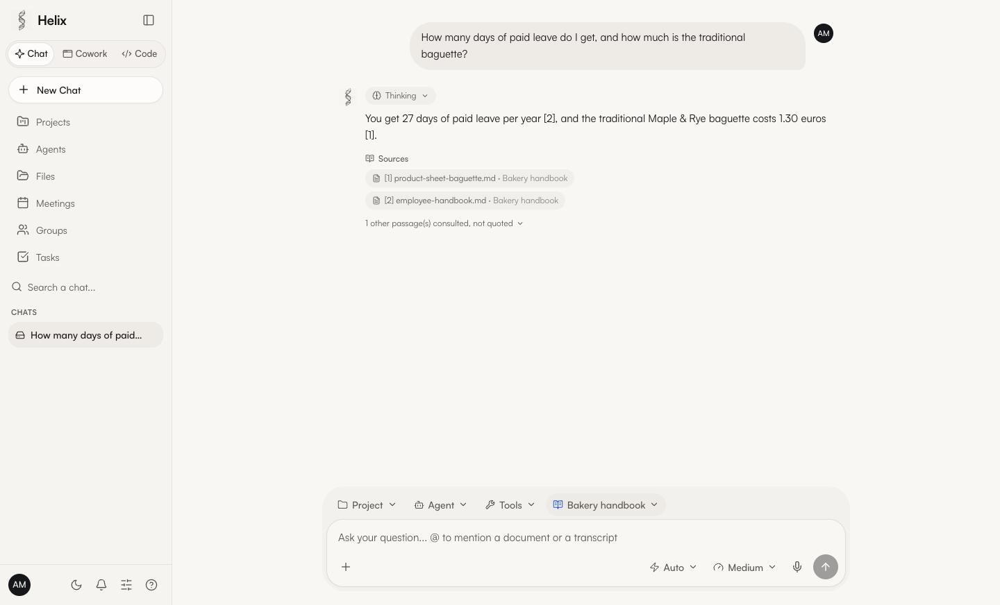
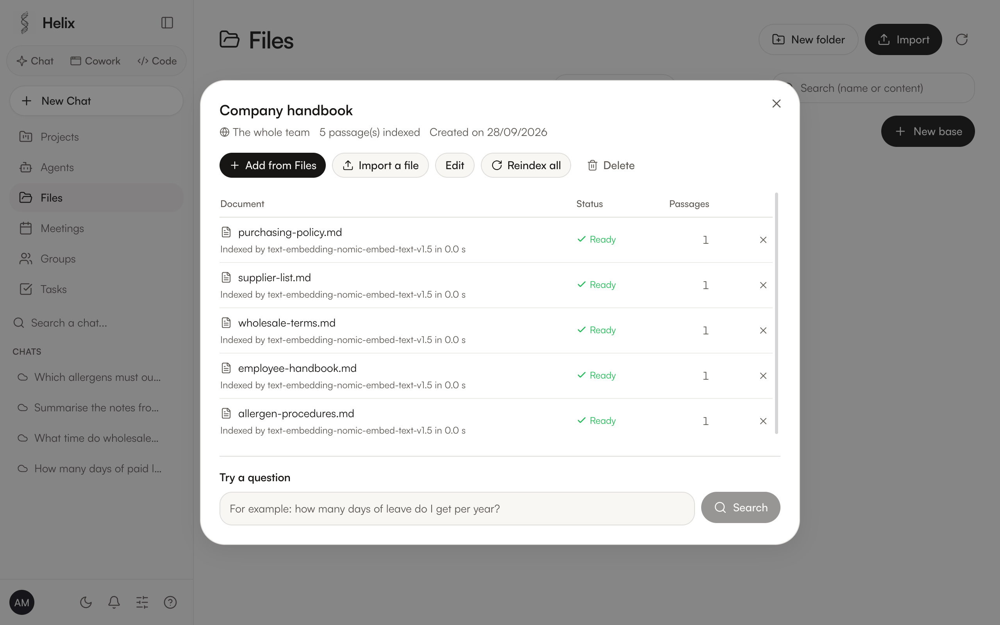
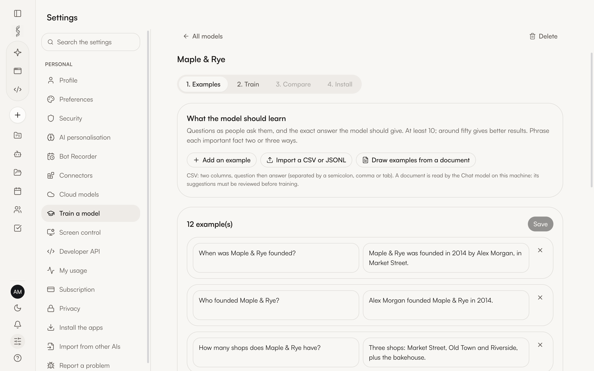
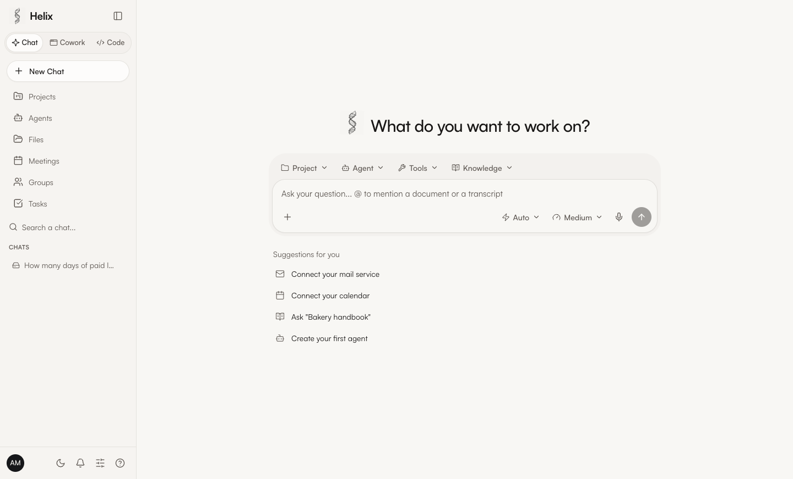
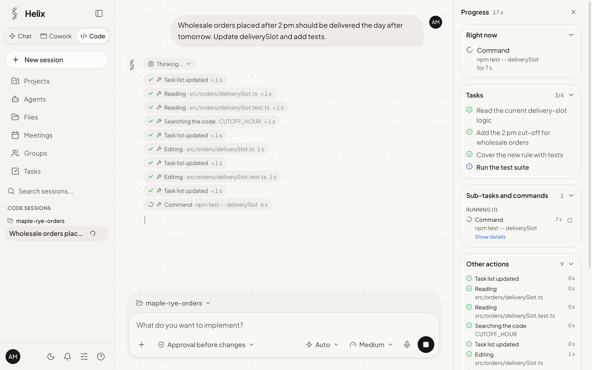

# HelixAI : votre espace de travail IA, sur vos propres machines

<p align="center">
  
</p>

<p align="center">
  <a href="README.md">English</a> ·
  <strong>Français</strong> ·
  <a href="README.zh.md">中文</a>
</p>

<p align="center">
  
  <a href="https://github.com/medhiclb/HelixAI/releases/latest"></a>
  
  
</p>

<p align="center">
  <a href="#installation">Installation</a>
  · <a href="#fonctions">Fonctions</a>
  · <a href="#construire-depuis-les-sources">Construire depuis les sources</a>
  · <a href="#documentation">Documentation</a>
  · <a href="#contribuer">Contribuer</a>
</p>

HelixAI réunit le Chat, les agents, le code, les bases de connaissances et
l'entraînement de modèles dans une application de bureau qui tourne **sur votre propre
matériel**. Chaque organisation installe sa propre instance : conversations, documents
et modèles restent sur ses machines, et rien n'est vendu ni loué.

<p align="center">
  
</p>

### Pourquoi HelixAI

- **Vos données restent chez vous.** Les modèles tournent sur votre machine ou sur le serveur
  de votre organisation ; vos conversations ne partent chez un fournisseur d'IA en ligne que si
  vous ajoutez vous-même une clé d'API.
- **Rien à régler.** Installez l'application, elle installe le reste : le moteur des modèles,
  le modèle adapté à votre matériel, Python et Node au besoin, versions épinglées et
  empreintes vérifiées.
- **Une application, beaucoup de métiers.** Chat, agents qui agissent sur vos fichiers et vos
  outils, agent de code, bases de connaissances aux sources citées, comptes rendus de
  réunion, entraînement de votre propre modèle.
- **Pensé pour les équipes.** Invitez vos collègues sur votre instance, partagez les bases par
  groupe, approuvez chaque action qui modifie quelque chose, gardez un journal d'audit.
- **Open source, sans abonnement.** AGPL-3.0, aucun compte chez nous, aucune télémétrie.

## Installation

Téléchargez le paquet de votre système dans la [dernière publication](https://github.com/medhiclb/HelixAI/releases/tag/v2026.927.3).
Empreintes SHA-256 : [`SHA256SUMS.txt`](https://github.com/medhiclb/HelixAI/releases/download/v2026.927.3/SHA256SUMS.txt).

| Système | Téléchargement | Installation |
|---|---|---|
| **macOS** (Apple Silicon) | [Helix-2026.927.3-arm64.dmg](https://github.com/medhiclb/HelixAI/releases/download/v2026.927.3/Helix-2026.927.3-arm64.dmg) | Ouvrez l'image disque et glissez Helix dans Applications. Au premier lancement : Réglages Système › Confidentialité et sécurité › « Ouvrir quand même » |
| **Windows 10/11** (x64) | [Helix-Setup-2026.927.3-x64.exe](https://github.com/medhiclb/HelixAI/releases/download/v2026.927.3/Helix-Setup-2026.927.3-x64.exe) | Lancez l'installateur (aucun droit d'administration nécessaire). Si SmartScreen s'affiche : « Informations complémentaires » › « Exécuter quand même » |
| **Ubuntu, Debian** (x64) | [helix-plateforme_2026.927.3_amd64.deb](https://github.com/medhiclb/HelixAI/releases/download/v2026.927.3/helix-plateforme_2026.927.3_amd64.deb) | `sudo apt install ./helix-plateforme_2026.927.3_amd64.deb` |
| **Autres Linux** (x64) | [Helix-2026.927.3.AppImage](https://github.com/medhiclb/HelixAI/releases/download/v2026.927.3/Helix-2026.927.3.AppImage) | `chmod +x Helix-2026.927.3.AppImage`, puis lancez-le. Sur Ubuntu 24.04, préférez le `.deb` |

Au premier lancement, Helix installe ce dont il a besoin : le moteur sans interface de
[LM Studio](https://lmstudio.ai) (version épinglée, empreinte vérifiée), ou l'application
LM Studio si elle sert déjà sur la machine, et le modèle le mieux adapté à la machine. Python,
Node et, pour Helix Code, [OpenCode](https://github.com/anomalyco/opencode) s'installent d'un
clic s'ils manquent (versions épinglées, empreintes vérifiées). Les nouvelles versions sont
annoncées dans l'application : un clic sur macOS ; sur Windows et Linux, le nouveau paquet est
proposé et s'installe par-dessus le précédent, vos données sont conservées.

**macOS, en une commande** (recommandé) : l'application s'installe sans l'avertissement de
Gatekeeper, après vérification de l'image disque contre `SHA256SUMS.txt` et de sa signature
de code :

```bash
curl -fsSL https://raw.githubusercontent.com/medhiclb/HelixAI/main/scripts/installer-macos.sh | sh
```

Les applications ne sont pas encore signées par Apple ni par Microsoft. Sur macOS, tant que
l'application n'est pas certifiée, macOS demande une fois après chaque nouvelle version
l'accès de Helix à sa clé du trousseau (« Helix Safe Storage ») : choisissez « Toujours
autoriser ». Sous Windows 11, le contrôle intelligent des applications (Smart App Control),
quand il est actif, bloque les applications non signées sans proposer de les lancer quand même.

Pour construire depuis les sources : `npm install`, `npm run build`, puis `npm run package`
(macOS), `npx electron-builder --win nsis --x64` (Windows) ou
`npx electron-builder --linux AppImage deb --x64` (Linux).

## Fonctions

- **Chat** avec des modèles locaux **choisis pour chaque machine** : Helix installe le modèle
  ouvert (Apache 2.0 ou MIT) le mieux noté qui tient dans sa mémoire, du petit portable à la
  station de travail, et propose les autres qu'elle peut faire tourner. Le catalogue couvre
  Qwen, Mistral (Magistral, Ministral), OpenAI gpt-oss, Z.ai GLM, IBM Granite, Ai2 OLMo, Meta et
  DeepSeek. Les modèles cloud marchent avec votre propre clé. Pièces jointes, dictée (Whisper, sur la machine), création d'images
  (Z-Image Turbo, FLUX.2 klein) et de courtes **vidéos** (Wan 2.1 et 2.2), elles aussi sur la machine.
- **Bases de connaissances (RAG)** : rassemblez des documents, l'instance les indexe sur
  la machine, et les réponses citent les passages utilisés. Chacun n'y retrouve que les
  documents qu'il a le droit de voir.
- **Cowork** : un agent qui travaille sur vos fichiers et, avec votre accord, sur un bureau
  virtuel (LibreOffice, navigateur) pour produire des documents Word, Excel, PowerPoint et PDF.
- **Helix Code** : un agent de code sur le dossier de votre projet (bâti sur OpenCode),
  aussi dans **VS Code** (extension fournie) et dans le terminal avec la **commande `helix`**.
- **Connecteurs** : courrier, Google Agenda (lecture et écriture), Google Drive, Slack, Notion
  et serveurs MCP, derrière une **barrière d'approbation** : rien qui modifie quelque chose ne
  se fait sans votre accord.
- **Tâches programmées** : une consigne et un rythme (chaque jour, du lundi au vendredi, un jour
  de la semaine ou du mois), exécutée avec vos outils, même fenêtre fermée, par l'agent de votre
  choix ; à créer dans Tâches ou en le demandant dans un Chat.
- **Agents toujours actifs** : missions programmées, réponses aux mails reçus et aux
  messageries, avec leurs propres bases de connaissances et leur photo. Un mail reçu est traité
  avec des droits réduits : sur le web, l'agent n'ouvre que des adresses déjà vues.
- **Entraîner un modèle** : apprenez à un petit modèle ouvert les faits de votre société à
  partir d'exemples, comparez-le à l'original, puis installez-le dans LM Studio (MLX sur
  puce Apple ; Unsloth sur carte NVIDIA).
- **API développeur** : des clés d'API personnelles pour l'API compatible OpenAI de
  l'instance (`/v1/models`, `/v1/chat/completions`, bases de connaissances comprises), en
  votre nom et rien de plus : aucune autre route, aucun outil exécuté par l'instance,
  révocables aussitôt.
- **Réunions** : enregistrement ou import, transcription et compte rendu sur la machine, bot de réunion.
- **Import** de votre historique depuis ChatGPT, Claude, Claude Code, Codex et Cursor.
- **Équipes** : comptes, groupes, partage, double authentification, journal d'audit,
  export RGPD, données chiffrées sur le disque. Les nouvelles versions sont annoncées dans
  l'application : un clic sur macOS, installées seulement si elles portent la signature de
  l'éditeur ; le nouveau paquet sous Windows et Linux.
- **Marque blanche** : nom du produit, logo et couleurs viennent d'un seul fichier de configuration.

<table>
  <tr>
    <td></td>
    <td></td>
  </tr>
  <tr>
    <td align="center">Bases de connaissances</td>
    <td align="center">Entraîner un modèle</td>
  </tr>
  <tr>
    <td></td>
    <td></td>
  </tr>
  <tr>
    <td align="center">Accueil</td>
    <td align="center">Helix Code</td>
  </tr>
</table>

## Construire depuis les sources

### Prérequis

- Une machine de développement sous macOS (puce Apple), Windows 10/11 ou Linux (x64) ; les
  paquets Windows et Linux se fabriquent aussi depuis un Mac
- Node.js 22.18 ou plus récent, et npm (seulement pour construire et développer, la passerelle
  exécute directement son TypeScript : l'application installée ne demande ni Node ni Python)

Rien d'autre à installer au préalable : au premier lancement, Helix installe le moteur sans
interface de [LM Studio](https://lmstudio.ai) (ou se sert de l'application LM Studio si elle
sert déjà) et le modèle adapté à la machine. 16 Go de mémoire sont conseillés ; sur une machine plus modeste, Helix choisit un
modèle plus léger.

### Lancer

```bash
git clone https://github.com/medhiclb/HelixAI
cd HelixAI
npm install
npm run app
```

`npm run app` compile la passerelle et ouvre l'application de bureau, qui démarre sa
propre passerelle locale. L'interface web seule se lance avec `npm run gateway` et
`npm run dev`, dans deux terminaux.

### Empaqueter et vérifier

```bash
npm run package      # macOS : .dmg et .zip dans release/
npx electron-builder --win nsis --x64            # installateur Windows (après npm run build)
npx electron-builder --linux AppImage deb --x64  # paquets Linux (après npm run build)
npm run typecheck    # interface et passerelle
npm run securite     # contrôles de sécurité contre une instance jetable
```

La signature et la notarisation sont prêtes et n'attendent qu'un certificat Apple :
voir [SIGNATURE.md](SIGNATURE.md).

## Ligne de commande

L'application de bureau fournit la commande `helix`. Mettez-la en place depuis
**Paramètres > Installer les apps > CLI**, puis :

```bash
helix connexion          # se connecter une fois avec son compte de l'instance
helix chat               # un Chat dans le terminal
helix chat --outils      # avec vos connecteurs, derrière la barrière d'approbation
helix code               # l'agent de code sur le dossier courant
```

## Documentation

La documentation technique est en français.

- [docs/GUIDE.md](docs/GUIDE.md) : le guide technique complet (passerelle, routes,
  connecteurs, déploiement, changement de marque)
- [ARCHITECTURE.md](ARCHITECTURE.md) : l'architecture et les décisions
- [SECURITE.md](SECURITE.md) : le modèle de sécurité et chaque contrôle
- [SCREENS.md](SCREENS.md) : chaque écran et ce qu'il fait vraiment
- [PROJET.md](PROJET.md) : intentions, décisions, état réel et ce qui reste à faire

## Communauté

- Questions et idées : [Discussions](https://github.com/medhiclb/HelixAI/discussions)
- Défauts et demandes : [Issues](https://github.com/medhiclb/HelixAI/issues)
- Failles de sécurité : à signaler en privé, voir [SECURITY.md](SECURITY.md)
- [Code de conduite](CODE_OF_CONDUCT.md)

## Contribuer

Les contributions sont les bienvenues. Lisez [CONTRIBUTING.md](CONTRIBUTING.md) et
signez le [CLA](CLA.md) avant votre première pull request.

## Licence

[GNU AGPL-3.0](LICENSE). Vous pouvez utiliser, modifier, redistribuer et vendre HelixAI.
Qui le distribue, ou le propose comme service en ligne, doit publier le code de sa
version sous la même licence. Détails dans [COPYRIGHT.md](COPYRIGHT.md).

LM Studio, le moteur de modèles par défaut, est un logiciel fermé dont les conditions
permettent l'usage personnel et l'usage interne d'une organisation, pas un service fourni à
d'autres : lisez [PROJET.md § 3.9](PROJET.md) avant d'héberger une instance pour d'autres.

## Remerciements

Construit avec des travaux open source, entre autres :
[OpenCode](https://github.com/anomalyco/opencode),
[OpenClaw](https://github.com/openclaw/openclaw),
[stable-diffusion.cpp](https://github.com/leejet/stable-diffusion.cpp),
[MLX](https://github.com/ml-explore/mlx),
[Unsloth](https://github.com/unslothai/unsloth),
[Whisper](https://github.com/openai/whisper),
[Qwen](https://github.com/QwenLM),
[LangChain.js](https://github.com/langchain-ai/langchainjs) (découpage des textes),
[AnythingLLM](https://github.com/Mintplex-Labs/anything-llm) (conception des bases
de connaissances), [UI UX Pro Max](https://github.com/nextlevelbuilder/ui-ux-pro-max-skill),
[Lume](https://github.com/trycua/cua), [Electron](https://www.electronjs.org),
[React](https://react.dev) et [Vite](https://vite.dev).
