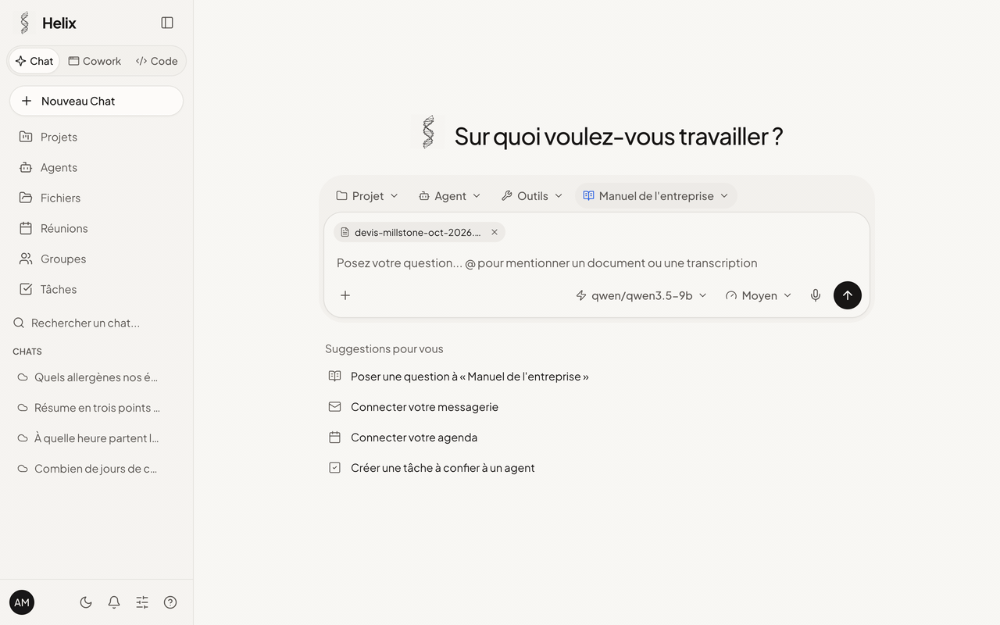
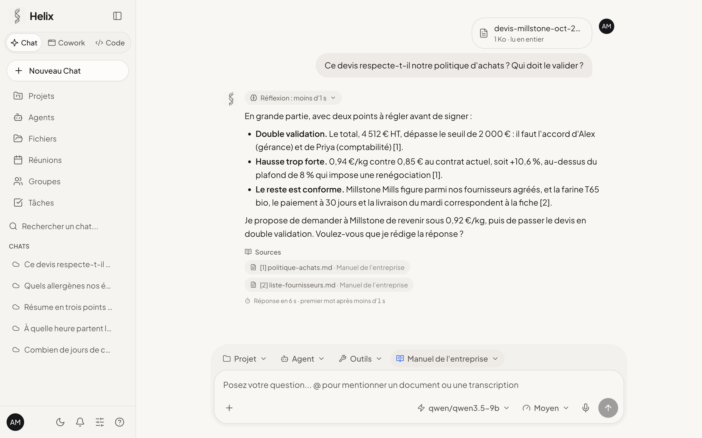
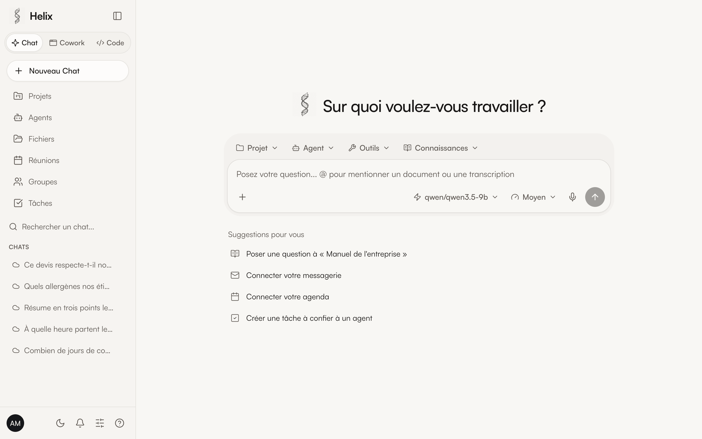
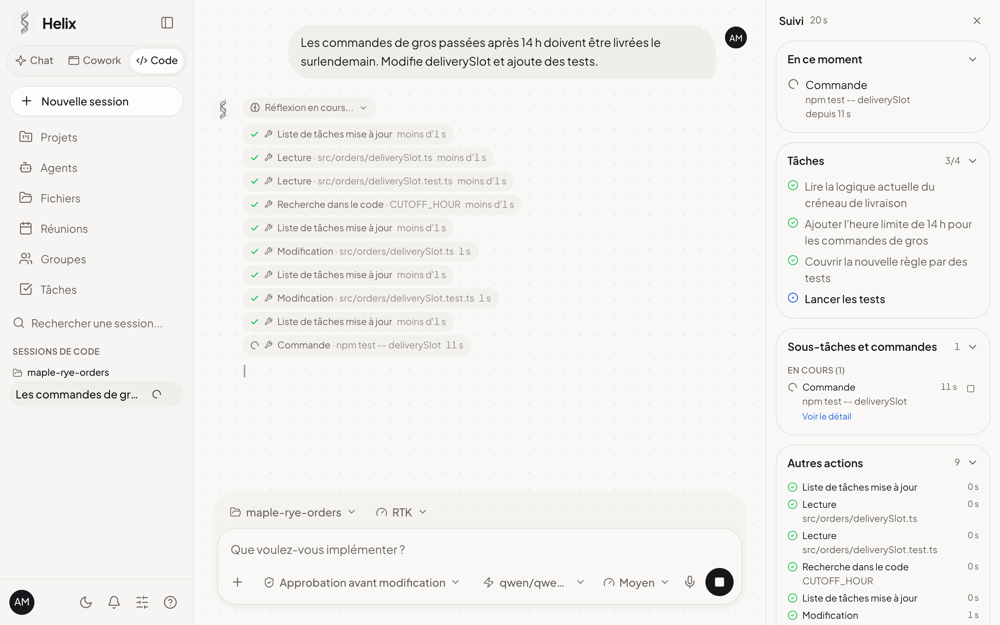
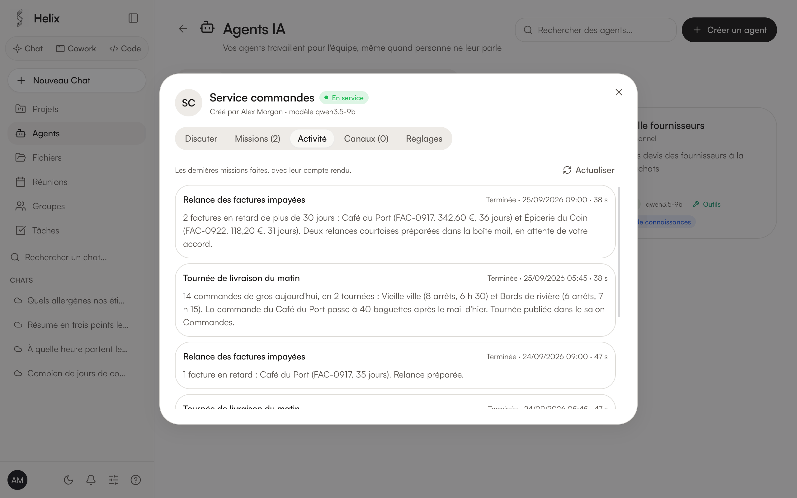
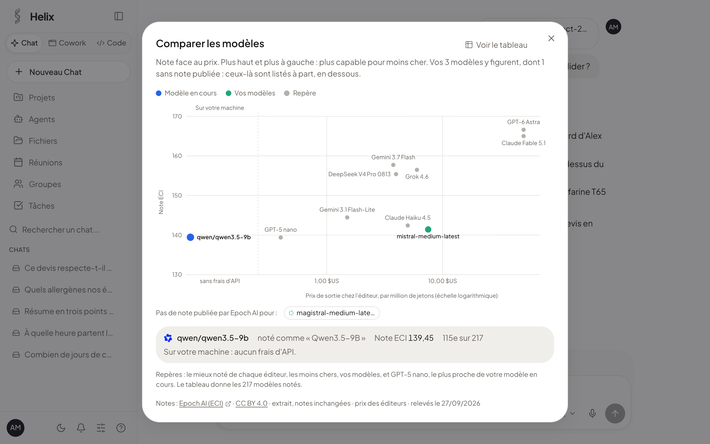
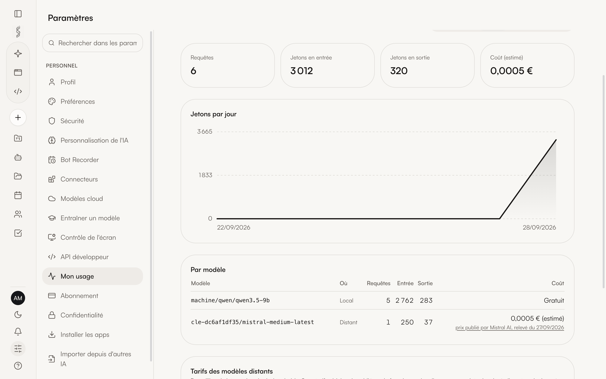
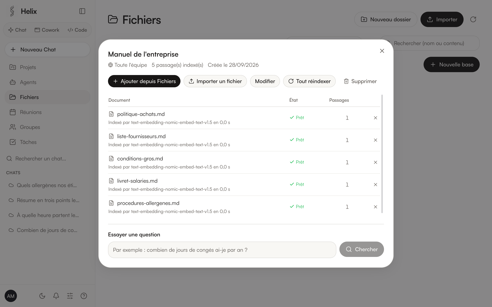

<p align="center">
  <picture>
    <source media="(prefers-color-scheme: dark)" srcset="docs/images/logo-dark.png" />
    
  </picture>
</p>

<h1 align="center">Helix AI</h1>

<p align="center">
  <strong>Votre espace de travail IA, sur vos propres machines.</strong><br />
  Chat, agents, code, bases de connaissances et entraînement de modèles dans une application de
  bureau open source, pour les équipes et les organisations qui veulent garder chez elles leurs
  documents et leurs conversations.
</p>

<p align="center">
  <a href="README.md">English</a> ·
  <strong>Français</strong> ·
  <a href="README.zh.md">中文</a> ·
  <a href="README.ja.md">日本語</a>
</p>

<p align="center">
  <a href="LICENSE"></a>
  <a href="https://github.com/medhiclb/HelixAI/releases/latest"></a>
  
  
  <a href="https://github.com/medhiclb/HelixAI/discussions"></a>
</p>

<p align="center">
  <a href="https://github.com/medhiclb/HelixAI/releases/download/v2026.928.1/Helix-2026.928.1-arm64.dmg"></a>
  <a href="https://github.com/medhiclb/HelixAI/releases/download/v2026.928.1/Helix-Setup-2026.928.1-x64.exe"></a>
  <a href="https://github.com/medhiclb/HelixAI/releases/download/v2026.928.1/helix-plateforme_2026.928.1_amd64.deb"></a>
  <a href="https://github.com/medhiclb/HelixAI/releases/download/v2026.928.1/Helix-2026.928.1.AppImage"></a>
</p>

<p align="center">
  <a href="#installation">Installation</a>
  · <a href="#captures">Captures</a>
  · <a href="#ce-qui-marche-et-ce-qui-nest-pas-encore-essayé">Ce qui marche</a>
  · <a href="#fonctions">Fonctions</a>
  · <a href="#construire-depuis-les-sources">Construire depuis les sources</a>
  · <a href="#contribuer">Contribuer</a>
</p>

<p align="center">
  
</p>

<p align="center"><sub>Une question sur un devis joint, la réponse tirée de la base de connaissances de l'entreprise, avec ses sources.</sub></p>

## Pourquoi Helix AI

- **Local par défaut.** Les modèles tournent sur votre machine ou sur le serveur de votre
  organisation, par le moteur de [LM Studio](https://lmstudio.ai), que Helix AI installe avec le
  modèle adapté à la mémoire de la machine. Aucun modèle cloud n'est jamais choisi à votre place.
- **Rien ne sort sans une clé que vous branchez.** Une conversation ne part chez un fournisseur
  cloud que si vous ajoutez sa clé d'API et choisissez l'un de ses modèles ; le sélecteur dit où
  tourne chaque modèle. En dehors des services que vous connectez vous-même (une clé cloud, une
  boîte mail, Drive, Slack…), l'application ne va sur le réseau que pour télécharger ce qu'elle
  installe (moteur, modèles, outils) et chercher les nouvelles versions (de Helix AI sur GitHub,
  d'OpenClaw sur npm).
- **Open source, rien à acheter.** AGPL-3.0, aucun compte chez nous, aucune télémétrie. Chaque
  organisation installe et fait tourner sa propre instance.
- **macOS, Windows et Linux.** Une même application pour les trois systèmes, en anglais, en
  français et en chinois. Elle est construite et utilisée chaque jour sur macOS ; les paquets
  Windows et Linux sont récents et bien moins éprouvés (voir [plus bas](#ce-qui-marche-et-ce-qui-nest-pas-encore-essayé)).
- **Des agents qui continuent de travailler.** Des agents avec leurs propres bases de
  connaissances et des missions programmées tournent fenêtre fermée et laissent un compte rendu
  de chaque passage ; ce qui modifie quelque chose attend l'accord d'une personne, sauf si vous
  en décidez autrement.
- **L'entraînement depuis l'application.** Apprenez à un petit modèle ouvert les faits de votre
  société à partir d'exemples de questions et de réponses, comparez-le à l'original, puis
  servez-vous-en dans le Chat (MLX sur puce Apple).
- **Pensé pour les équipes.** Comptes, groupes, bases de connaissances partagées par groupe,
  double authentification, journal d'audit et données chiffrées sur le disque.

## Captures

<table>
  <tr>
    <td width="50%"></td>
    <td width="50%"></td>
  </tr>
  <tr>
    <td align="center">Un Chat avec une base de connaissances, une pièce jointe et ses sources</td>
    <td align="center">Accueil</td>
  </tr>
  <tr>
    <td></td>
    <td></td>
  </tr>
  <tr>
    <td align="center">Helix Code au travail</td>
    <td align="center">Les agents toujours actifs et les comptes rendus de leurs missions</td>
  </tr>
  <tr>
    <td></td>
    <td></td>
  </tr>
  <tr>
    <td align="center">Comparer les modèles (note face au prix)</td>
    <td align="center">Mon usage</td>
  </tr>
  <tr>
    <td></td>
    <td></td>
  </tr>
  <tr>
    <td align="center">Bases de connaissances</td>
    <td align="center">Entraîner un modèle</td>
  </tr>
</table>

<sub>Captures et animation prises le 28 septembre 2026 sur une instance de démonstration
jetable : l'entreprise (Maple & Rye, une boulangerie), ses salariés et ses documents sont
inventés, le moteur de modèles et la clé Mistral sont simulés, et les réponses des modèles comme
les comptes rendus des missions ont été écrits à l'avance. L'interface est celle de la version
actuelle ; Qwen3.5 9B est l'un des modèles que Helix AI installe, et les notes et les prix de
« Comparer les modèles » sont les vrais chiffres publiés.</sub>

## Ce qui marche, et ce qui n'est pas encore essayé

Helix AI dit à l'écran ce qu'il a vérifié, et cette page fait de même. La liste complète et
datée est dans [PROJET.md](PROJET.md).

**Essayé et mesuré**

- **macOS sur puce Apple** est la plateforme où Helix AI est développé et essayé : le Chat avec
  des modèles locaux, les bases de connaissances aux sources citées, les pièces jointes, Helix
  Code et les réunions y ont tous tourné.
- **Les agents toujours actifs** (sur [OpenClaw](https://github.com/openclaw/openclaw) 2026.9.4),
  de bout en bout : déploiement, conversations cloisonnées par personne, missions programmées,
  demandes d'accord qui nomment l'agent, comptes rendus, suppression.
- **Les réunions** : un enregistrement de 29 secondes importé, transcrit et résumé en 18 à
  36 secondes.
- **Mon usage** : des nombres de jetons identiques à ceux que rend le moteur.
- **L'entraînement sur Mac** (MLX) : lors d'un essai mesuré, Qwen3 1.7B a appris 15 faits sur 15.
- **La sécurité** : `npm run securite` attaque une instance jetable de l'extérieur, avec plus de
  400 contrôles, avant chaque version ([SECURITE.md](SECURITE.md)).
- **Linux** : le `.deb` installé et utilisé (moteur, modèle, Chat) dans un conteneur Ubuntu
  24.04.

**Pas encore essayé**

- **Windows** : l'installateur n'a pas encore été lancé sur un vrai PC (installation,
  SmartScreen, premier lancement, moteur, Chat). La mise à jour d'un clic sous Windows est
  écrite, pas essayée.
- **Linux sur une vraie machine** (seulement un conteneur jusqu'ici), l'AppImage, l'icône de la
  zone de notification sous GNOME.
- **L'entraînement sur carte NVIDIA** (Unsloth, PyTorch CUDA) : écrit d'après la documentation,
  jamais lancé.
- **Les fournisseurs cloud avec de vraies clés** : essayés de bout en bout contre des imitations
  des API de sept fournisseurs, pas encore avec une vraie clé pour chacun.
- **Les vrais comptes** : le bot dans une vraie réunion Google Meet, un agent qui répond à un
  vrai mail ou sur une messagerie (Telegram, WhatsApp, Discord, Slack), une mise à jour d'un clic
  entre deux versions sur un poste rattaché à une instance.
- **La signature** : les applications ne sont pas encore signées par Apple ni par Microsoft
  ([SIGNATURE.md](SIGNATURE.md)).

Non proposés sous Windows : les agents toujours actifs (OpenClaw y demande WSL) et la ligne de
commande `helix`.

## Installation

Téléchargez le paquet de votre système dans la
[publication v2026.928.1](https://github.com/medhiclb/HelixAI/releases/tag/v2026.928.1).
Empreintes SHA-256 : [`SHA256SUMS.txt`](https://github.com/medhiclb/HelixAI/releases/download/v2026.928.1/SHA256SUMS.txt).

| Système | Téléchargement | Installation |
|---|---|---|
| **macOS** (puce Apple) | [Helix-2026.928.1-arm64.dmg](https://github.com/medhiclb/HelixAI/releases/download/v2026.928.1/Helix-2026.928.1-arm64.dmg) | Ouvrez l'image disque et glissez Helix dans Applications. Au premier lancement : Réglages Système › Confidentialité et sécurité › « Ouvrir quand même » |
| **Windows 10/11** (x64) | [Helix-Setup-2026.928.1-x64.exe](https://github.com/medhiclb/HelixAI/releases/download/v2026.928.1/Helix-Setup-2026.928.1-x64.exe) | Lancez l'installateur (aucun droit d'administration nécessaire). Si SmartScreen s'affiche : « Informations complémentaires » › « Exécuter quand même » |
| **Ubuntu, Debian** (x64) | [helix-plateforme_2026.928.1_amd64.deb](https://github.com/medhiclb/HelixAI/releases/download/v2026.928.1/helix-plateforme_2026.928.1_amd64.deb) | `sudo apt install ./helix-plateforme_2026.928.1_amd64.deb` |
| **Autres Linux** (x64) | [Helix-2026.928.1.AppImage](https://github.com/medhiclb/HelixAI/releases/download/v2026.928.1/Helix-2026.928.1.AppImage) | `chmod +x Helix-2026.928.1.AppImage`, puis lancez-le. Sur Ubuntu 24.04, préférez le `.deb` |

**macOS, en une commande** (recommandé) : l'application s'installe sans l'avertissement de
Gatekeeper, après vérification de l'image disque contre `SHA256SUMS.txt` et de sa signature de
code :

```bash
curl -fsSL https://raw.githubusercontent.com/medhiclb/HelixAI/main/scripts/installer-macos.sh | sh
```

Au premier lancement, Helix AI installe ce dont il a besoin : le moteur sans interface de
LM Studio (version épinglée, empreinte vérifiée), ou l'application LM Studio si elle sert déjà
sur la machine, et le modèle le mieux adapté à la machine. 16 Go de mémoire sont conseillés ; sur
une machine plus modeste, un modèle plus léger est choisi. Python, Node et, pour Helix Code,
[OpenCode](https://github.com/anomalyco/opencode) s'installent d'un clic s'ils manquent
(versions épinglées, empreintes vérifiées) ; le modèle de conversation vient du catalogue de
LM Studio, à la version que LM Studio sert.

Les nouvelles versions sont annoncées dans l'application : un clic sur macOS ; sous Windows et
Linux, le nouveau paquet est proposé et s'installe par-dessus le précédent, vos données sont
conservées. Tant que l'application n'est pas certifiée, macOS demande une fois après chaque
nouvelle version l'accès de Helix à sa clé du trousseau (« Helix Safe Storage ») : choisissez
« Toujours autoriser ». Sous Windows 11, le contrôle intelligent des applications (Smart App
Control), quand il est actif, bloque les applications non signées sans proposer de les lancer
quand même.

## Fonctions

- **Chat** avec des modèles locaux **choisis pour chaque machine** : Helix AI installe le modèle
  ouvert (Apache 2.0 ou MIT) le mieux noté qui tient dans sa mémoire, du petit portable à la
  station de travail, et propose les autres qu'elle peut faire tourner. Le catalogue couvre Qwen,
  Mistral (Magistral, Ministral), OpenAI gpt-oss, Z.ai GLM, IBM Granite, Ai2 OLMo, Meta et
  DeepSeek. Les modèles cloud marchent avec votre propre clé. Pièces jointes, dictée (Whisper,
  sur la machine), création d'images (Z-Image Turbo, FLUX.2 klein) et de courtes vidéos (Wan 2.1
  et 2.2), elles aussi sur la machine.
- **Comparer les modèles** : chaque modèle que vous pouvez utiliser, placé selon sa note de
  capacités face au prix que demande son éditeur, pour peser sur un même graphique un modèle
  local et un modèle cloud.
- **Bases de connaissances (RAG)** : rassemblez des documents, l'instance les indexe sur la
  machine, et les réponses citent les passages utilisés. Chacun n'y retrouve que les documents
  qu'il a le droit de voir.
- **Cowork** : un agent qui travaille sur vos fichiers et, avec votre accord, sur un bureau
  virtuel (LibreOffice, navigateur) pour produire des documents Word, Excel, PowerPoint et PDF.
- **Helix Code** : un agent de code sur le dossier de votre projet (bâti sur OpenCode), avec un
  panneau qui suit en direct ses tâches, ses commandes et les fichiers modifiés ; aussi dans
  **VS Code** (extension fournie) et dans le terminal avec la **commande `helix`**.
- **Connecteurs** : courrier, Google Agenda (lecture et écriture), Google Drive, Slack, Notion et
  serveurs MCP, derrière une **barrière d'approbation** : rien qui modifie quelque chose ne se
  fait sans votre accord.
- **Tâches programmées** : une consigne et un rythme (chaque jour, du lundi au vendredi, un jour
  de la semaine ou du mois), exécutée avec vos outils, même fenêtre fermée, par l'agent de votre
  choix.
- **Agents toujours actifs** : missions programmées, réponses aux mails reçus et aux messageries,
  avec leurs propres bases de connaissances et leur photo. Un mail reçu est traité avec des
  droits réduits : sur le web, l'agent n'ouvre que des adresses déjà vues.
- **Entraîner un modèle** : exemples, entraînement, comparaison avec l'original, puis
  installation dans LM Studio (MLX sur puce Apple ; Unsloth sur carte NVIDIA, pas encore essayé).
- **Mon usage** : requêtes et jetons par modèle, lus dans la réponse de chaque moteur ; un modèle
  local ne coûte aucun frais d'API, un modèle cloud est compté à votre tarif ou au prix publié
  par son fournisseur, daté.
- **API développeur** : des clés d'API personnelles pour l'API compatible OpenAI de l'instance
  (`/v1/models`, `/v1/chat/completions`, bases de connaissances comprises), en votre nom et rien
  de plus, révocables aussitôt.
- **Réunions** : enregistrement ou import, transcription et compte rendu sur la machine, bot de
  réunion.
- **Import** de votre historique depuis ChatGPT, Claude, Claude Code, Codex et Cursor.
- **Équipes** : comptes, groupes, partage, double authentification, journal d'audit, export
  RGPD, données chiffrées sur le disque.
- **Marque blanche** : nom du produit, logo et couleurs viennent d'un seul fichier de
  configuration.

## Construire depuis les sources

Prérequis : macOS (puce Apple), Windows 10/11 ou Linux (x64), Node.js 22.18 ou plus récent et
npm. Node ne sert qu'à construire et développer : la passerelle exécute directement son
TypeScript, et l'application installée ne demande ni Node ni Python.

```bash
git clone https://github.com/medhiclb/HelixAI
cd HelixAI
npm install
npm run app
```

`npm run app` compile la passerelle et ouvre l'application de bureau, qui démarre sa propre
passerelle locale. L'interface web seule se lance avec `npm run gateway` et `npm run dev`, dans
deux terminaux.

```bash
npm run package      # macOS : .dmg et .zip dans release/
npx electron-builder --win nsis --x64            # installateur Windows (après npm run build)
npx electron-builder --linux AppImage deb --x64  # paquets Linux (après npm run build)
npm run typecheck    # interface et passerelle
npm run securite     # contrôles de sécurité contre une instance jetable
```

La signature et la notarisation sont prêtes et n'attendent qu'un certificat Apple : voir
[SIGNATURE.md](SIGNATURE.md).

### Ligne de commande

L'application de bureau fournit la commande `helix`. Mettez-la en place depuis
**Paramètres › Installer les apps › CLI**, puis :

```bash
helix connexion          # se connecter une fois avec son compte de l'instance
helix chat               # un Chat dans le terminal
helix chat --outils      # avec vos connecteurs, derrière la barrière d'approbation
helix code               # l'agent de code sur le dossier courant
```

### Documentation

[docs/GUIDE.md](docs/GUIDE.md) (passerelle, routes, connecteurs, déploiement, changement de
marque), [ARCHITECTURE.md](ARCHITECTURE.md), [SECURITE.md](SECURITE.md),
[SCREENS.md](SCREENS.md) (chaque écran et ce qu'il fait vraiment) et [PROJET.md](PROJET.md)
(intentions, décisions, état réel).

## Contribuer

Les contributions sont les bienvenues, d'une coquille à un nouveau connecteur.

- Lisez [CONTRIBUTING.md](CONTRIBUTING.md), et signez le [CLA](CLA.md) avant votre première pull
  request.
- Questions et idées : [Discussions](https://github.com/medhiclb/HelixAI/discussions).
- Défauts et demandes : [Issues](https://github.com/medhiclb/HelixAI/issues), ou depuis
  l'application : Paramètres › Signaler un problème, qui prépare un ticket ou un mail que vous
  relisez et envoyez vous-même.
- Failles de sécurité : à signaler en privé, voir [SECURITY.md](SECURITY.md).
- [Code de conduite](CODE_OF_CONDUCT.md).

## Licence

[GNU AGPL-3.0](LICENSE). Vous pouvez utiliser, modifier, redistribuer et vendre Helix AI. Qui
le distribue, ou le propose comme service en ligne, doit publier le code de sa version sous la
même licence. Détails dans [COPYRIGHT.md](COPYRIGHT.md).

LM Studio, le moteur de modèles par défaut, est un logiciel fermé dont les conditions permettent
l'usage personnel et l'usage interne d'une organisation, pas un service fourni à d'autres :
lisez [PROJET.md § 3.9](PROJET.md) avant d'héberger une instance pour d'autres.

## Remerciements

Les notes des modèles de « Comparer les modèles » viennent d'**Epoch AI**,
[Capabilities & benchmarking](https://epoch.ai/benchmarks/use-this-data) (indice ECI, Epoch
Capabilities Index), sous licence [CC BY 4.0](https://creativecommons.org/licenses/by/4.0/),
relevées le 27 septembre 2026. Les prix viennent des pages de prix des éditeurs, relevées le
même jour.

Construit avec des travaux open source, entre autres :
[OpenCode](https://github.com/anomalyco/opencode),
[OpenClaw](https://github.com/openclaw/openclaw),
[stable-diffusion.cpp](https://github.com/leejet/stable-diffusion.cpp),
[MLX](https://github.com/ml-explore/mlx),
[Unsloth](https://github.com/unslothai/unsloth),
[Whisper](https://github.com/openai/whisper),
[Qwen](https://github.com/QwenLM),
[LangChain.js](https://github.com/langchain-ai/langchainjs) (découpage des textes),
[AnythingLLM](https://github.com/Mintplex-Labs/anything-llm) (conception des bases de
connaissances), [UI UX Pro Max](https://github.com/nextlevelbuilder/ui-ux-pro-max-skill),
[Lume](https://github.com/trycua/cua), [Electron](https://www.electronjs.org),
[React](https://react.dev) et [Vite](https://vite.dev).
